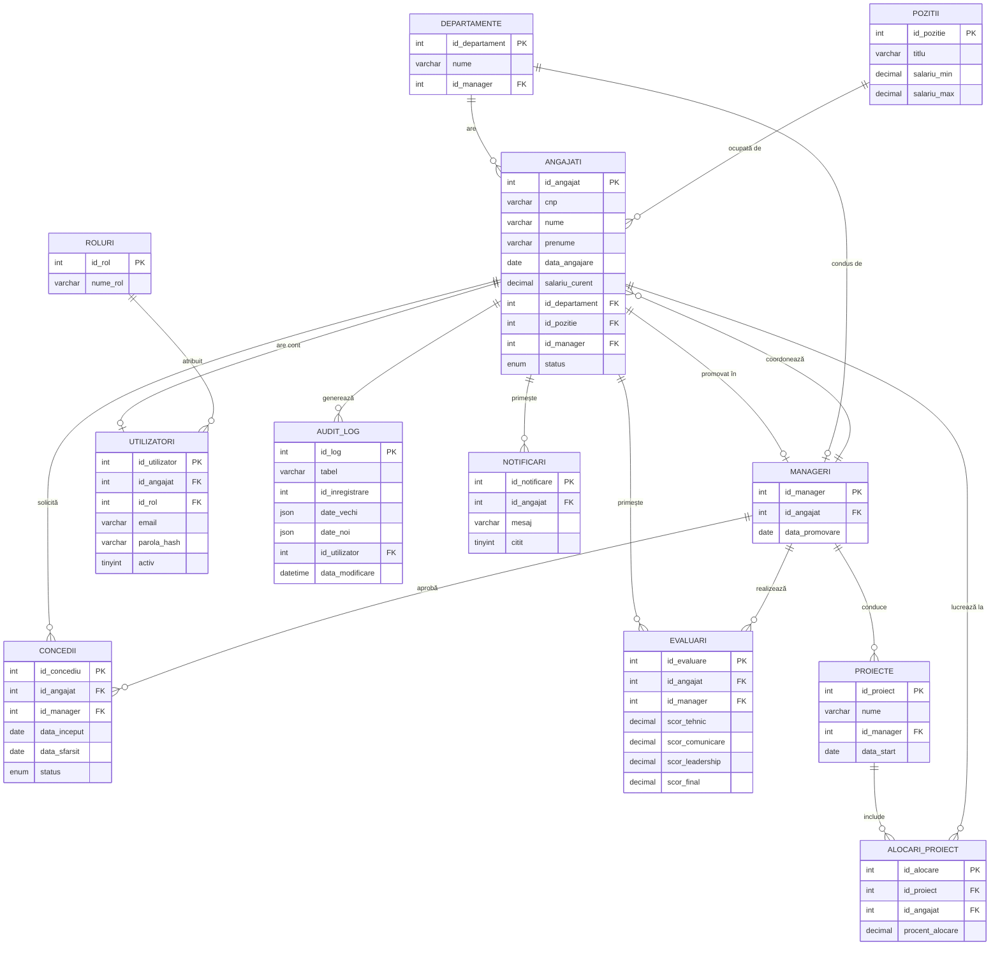

# M&M Bloom — Documentația completă a sistemului HR

> **Companie:** M&M Bloom (IT / software & consultanță)
> **Sistem:** aplicație internă de management al resurselor umane
> **Stack:** MariaDB 10.4 · Flask 3 (Python 3.12) · React SPA · Machine Learning (RF / LR / XGBoost)

---

## Cuprins general

- [PARTEA I — Prezentare generală a sistemului](#partea-i--prezentare-generală-a-sistemului)
- [PARTEA II — Baza de date (`my_database`)](#partea-ii--baza-de-date-my_database)
- [PARTEA III — Backend (API Flask)](#partea-iii--backend-api-flask)
- [PARTEA IV — Frontend (React SPA)](#partea-iv--frontend-react-spa)
- [PARTEA V — Modul Employee Churn (ML)](#partea-v--modul-employee-churn-ml)
- [Anexă — Glosar și convenții comune](#anexă--glosar-și-convenții-comune)

---

## PARTEA I — Prezentare generală a sistemului

Aplicația HR M&M Bloom acoperă întregul ciclu de viață al angajatului într-o companie de software: structură organizațională, recrutare și onboarding, evaluări de performanță, salarizare, concedii, alocare pe proiecte, beneficii, audit și predicție analitică a riscului de plecare.

### Arhitectura pe trei straturi (+ ML)

```
┌─────────────────────────────────────────────────────────────┐
│  Frontend React SPA  (axios + JWT + RBAC pe UI)             │  ← PARTEA IV
└───────────────────────────┬─────────────────────────────────┘
                            │ HTTPS / REST
┌───────────────────────────▼─────────────────────────────────┐
│  Backend Flask  (~55 endpoint-uri, JWT, RBAC, audit)        │  ← PARTEA III
└───────────────────────────┬─────────────────────────────────┘
                            │ mysql-connector-python
┌───────────────────────────▼─────────────────────────────────┐
│  MariaDB `my_database`                                      │  ← PARTEA II
│  17 tabele · 4 view-uri · 13 triggere · 6 proceduri · 18 FK │
└───────────────────────────┬─────────────────────────────────┘
                            │ SELECT (read-only) + INSERT predictii
┌───────────────────────────▼─────────────────────────────────┐
│  Modul ML Employee Churn  (RF · LR · XGBoost · comparație)  │  ← PARTEA V
└─────────────────────────────────────────────────────────────┘
```

### Cum se leagă piesele între ele

| Strat | Citește din | Scrie în | Consumat de |
|---|---|---|---|
| Baza de date | — | — | Backend, Modulul ML |
| Backend Flask | MariaDB | MariaDB (CRUD + `audit_log`) | Frontend |
| Frontend React | Backend (REST + JWT) | Backend | Utilizatori finali |
| ML Employee Churn | MariaDB (SELECT) | Tabelele `predictii_churn_rf/_lr/_xgb` | Backend → Frontend (vizualizare risc) |

### Roluri funcționale (RBAC)

Sistemul este construit în jurul a 5 roluri principale, păstrate consistent în toate straturile:

- **CEO** - vedere de ansamblu pe companie, statistici la nivel înalt
- **Director** — vedere de ansamblu pe locația pe care o administrează
- **HR Manager** — vedere pe departamentul propriu și subordonați direcți/indirecți
- **Team Leader** — vedere pe echipa proprie
- **Project manager** - vedere pe propriile proiecte
- **HR specialist** — CRUD complet pe angajați, concedii, beneficii, evaluări
- **Angajat** — vedere pe profilul propriu, cereri de concediu, beneficii

Restul documentului detaliază fiecare strat în ordinea fluxului de date (DB → Backend → Frontend → ML).

---

## PARTEA II — Baza de date (`my_database`)

_Această parte descrie modelul de date relațional pe care se sprijină tot sistemul. Toate referințele la tabele și triggere din PARTEA III (Backend) și PARTEA V (ML) trimit la entitățile definite aici._

> **Sistem de Resurse Umane (HR)**
> DBMS: MariaDB 10.4 / MySQL 5.7+ • Charset: `utf8mb4_general_ci` • Engine: `InnoDB`
> Generat: Aprilie 2026

---

### Cuprins

1. [Introducere](#1-introducere)
2. [Logica generală a sistemului](#2-logica-generală-a-sistemului)
3. [Structura tabelelor](#3-structura-tabelelor)
4. [Relații și chei străine](#4-relații-și-chei-străine)
5. [Triggere — logica automatizată](#5-triggere--logica-automatizată)
6. [View-uri](#6-view-uri)
7. [Indexare și performanță](#7-indexare-și-performanță)
8. [Securitate, integritate și audit](#8-securitate-integritate-și-audit)
9. [Convenții de denumire](#9-convenții-de-denumire)
10. [Fluxuri tipice de utilizare](#10-fluxuri-tipice-de-utilizare)

---

### 1. Introducere

Baza de date `my_database` modelează un sistem complet de management al resurselor umane (HR) pentru o companie de tip IT/consultanță. Acoperă:

- **structura organizațională** (departamente, poziții, manageri, ierarhie),
- **ciclul de viață al angajatului** (angajare, evaluare, modificări salariale, beneficii, concedii, soft delete),
- **execuția proiectelor** (proiecte, alocări, roluri),
- **acces și securitate** (utilizatori, roluri, audit log, notificări).

Sistemul conține **17 tabele**, **4 view-uri**, **13 triggere**, **6 proceduri stocate** și **18 chei străine**, plus un set extins de indecși optimizați pentru interogări frecvente. Cele 3 tabele `predictii_churn_*` materializează rezultatele modelului ML (vezi PARTEA V).

---

### 2. Logica generală a sistemului

Schema este construită în jurul tabelei centrale **`angajati`**. Toate celelalte entități fie *aparțin* unui angajat, fie *îl referențiază*.

```
            departamente ──┐
                           │
   pozitii ─── angajati ───┼─── manageri ─── (subordonati)
                  │        │
       ┌──────────┼────────┴──────────┐
       │          │                   │
  evaluari   istoric_salarial    utilizatori (1:1)
       │          │                   │
   concedii  beneficii_angajati   audit_log
       │
  alocari_proiecte ─── proiecte
```

#### Principii arhitecturale

1. **Soft delete obligatoriu pe `angajati`** — angajații nu se șterg fizic; trec pe `status='inactiv'`. Triggerul `trg_audit_stergere_logica` salvează un snapshot complet în `audit_log`, păstrând conformitatea (GDPR + audit financiar).
2. **Manager ≠ angajat la nivel de model** — `manageri` este o tabelă separată legată 1:1 de `angajati`. Aceasta permite ca un angajat să devină manager (sau invers) fără a duplica date și menține FK-urile curate (`concedii.id_aprobator`, `departamente.id_manager` referențiază `manageri`, nu `angajati`).
3. **Validări la nivel de bază de date** — toate regulile de business critice (grilă salarială, scoruri evaluare, suprapuneri concedii, alocare ore) sunt impuse prin triggere, nu doar prin aplicație. Astfel, integritatea este garantată indiferent de client (aplicație web, scripturi, import direct).
4. **Audit pasiv** — modificările sensibile (CNP, email, telefon, salariu) sunt înregistrate automat în `audit_log` prin triggere `AFTER UPDATE`, fără cod aplicație suplimentar.
5. **Separare identitate vs. autentificare** — `angajati` conține datele personale; `utilizatori` conține credențialele și rolul de acces (1:1). Un angajat poate exista fără cont (ex. tehnicieni fără acces în sistem).

---

### 3. Structura tabelelor

#### 3.1 `angajati` — tabela centrală

| Coloană | Tip | Constrângeri |
|---|---|---|
| `id_angajat` | INT | **PK**, AUTO_INCREMENT |
| `nume` | VARCHAR(100) | |
| `prenume` | VARCHAR(30) | NOT NULL |
| `cnp` | VARCHAR(13) | **UNIQUE**, NOT NULL — date sensibile |
| `email` | VARCHAR(100) | **UNIQUE**, NOT NULL |
| `telefon` | VARCHAR(17) | NOT NULL |
| `data_angajare` | DATE | NOT NULL |
| `id_departament` | INT | FK → `departamente` |
| `id_pozitie` | INT | FK → `pozitii` |
| `id_manager` | INT | FK → `manageri` (NULL pt. top mgmt) |
| `status` | ENUM('activ','inactiv') | DEFAULT 'activ' (soft delete) |
| `salariu_curent` | DECIMAL(10,2) | NOT NULL |

**Logică:** orice modificare a salariului declanșează `trg_modificare_salariu` care creează automat o intrare în `istoric_salarial`. Modificarea CNP/email/telefon/salariu este înregistrată în `audit_log`. Trecerea pe `status='inactiv'` produce snapshot complet.

---

#### 3.2 `departamente`

| Coloană | Tip | Constrângeri |
|---|---|---|
| `id_departament` | INT | **PK** |
| `nume` | VARCHAR(30) | NOT NULL |
| `locatie` | VARCHAR(60) | NOT NULL |
| `id_manager` | INT | FK → `manageri` (șeful departamentului) |

**Logică:** fiecare departament are exact un manager. Relația `departamente.id_manager` ↔ `manageri.id_departament` este redundantă intenționat — permite atât interogări „cine conduce departamentul X" cât și „ce departament conduce managerul Y" fără JOIN-uri costisitoare.

---

#### 3.3 `pozitii` — grilă salarială

| Coloană | Tip | Constrângeri |
|---|---|---|
| `id_pozitie` | INT | **PK** |
| `titlu` | VARCHAR(30) | NOT NULL |
| `salariu_min` | DECIMAL(10,2) | NOT NULL |
| `salariu_max` | DECIMAL(10,2) | NOT NULL |
| `nivel` | ENUM | junior/associate/intermediate/senior/consultant/principal |

**Logică:** definește banda salarială per poziție. Triggerele `trg_validare_salariu_pozitie` (INSERT) și `trg_validare_salariu_update` (UPDATE) verifică obligatoriu ca `salariu_curent ∈ [salariu_min, salariu_max]`.

---

#### 3.4 `manageri`

| Coloană | Tip | Constrângeri |
|---|---|---|
| `id_manager` | INT | **PK** |
| `id_angajat` | INT | FK → `angajati` (1:1) |
| `id_departament` | INT | FK → `departamente` |
| `data_numire` | DATE | NOT NULL |
| `bonus_management` | DECIMAL(7,2) | NOT NULL |
| `tip` | ENUM | team_leader/project_manager/director |

**Logică:** un manager este un angajat „promovat". Tipul determină permisiunile aprobării concediilor și ierarhia. `bonus_management` este separat de salariul de bază (rămâne în `angajati.salariu_curent`).

---

#### 3.5 `proiecte` și `alocari_proiecte`

```
proiecte (1) ──< (N) alocari_proiecte (N) >── (1) angajati
```

**`proiecte`**: id, nume, descriere, perioadă, status (planificat/in desfasurare/finalizat), buget.
**`alocari_proiecte`**: legătura M:N cu rol, ore alocate săptămânal, perioadă efectivă.

**Logică:** un angajat poate fi alocat pe mai multe proiecte simultan, dar `trg_validare_alocare_proiect` garantează că suma orelor alocate active nu depășește 40h/săptămână (≈ normă întreagă).

---

#### 3.6 `evaluari`

| Coloană | Tip | Constrângeri |
|---|---|---|
| `id_evaluare` | INT | **PK** |
| `id_angajat` | INT | FK → `angajati` (evaluat) |
| `id_evaluator` | INT | FK → `angajati` (evaluator) |
| `data_evaluare` | DATE | |
| `scor_tehnic` | INT | 1–10 (validat) |
| `scor_comunicare` | INT | 1–10 (validat) |
| `scor_leadership` | INT | 1–10 (validat) |
| `scor_final` | DECIMAL(5,2) | **calculat automat** |
| `feedback` | TEXT | |

**Logică:** `scor_final` nu se trimite din aplicație; este calculat de `trg_calcul_scor_final` ca:

```
scor_final = 0.5 × scor_tehnic + 0.3 × scor_comunicare + 0.2 × scor_leadership
```

Dacă `scor_final < 5`, `trg_notificare_evaluare_scazuta` generează notificare automată către angajat și manager.

---

#### 3.7 `concedii`

| Coloană | Tip | Constrângeri |
|---|---|---|
| `id_concediu` | INT | **PK** |
| `id_angajat` | INT | FK → `angajati` (solicitant) |
| `id_aprobator` | INT | FK → `manageri` (aprobator) |
| `tip` | ENUM | odihna/boala/concediu fara plata |
| `data_start`, `data_sfarsit` | DATE | NOT NULL |
| `status` | ENUM | aprobat/respins/in asteptare |

**Logică:** validări impuse prin trigger:
- `data_start ≤ data_sfarsit`,
- `id_aprobator ≠ id_angajat` (nu te poți auto-aproba),
- nicio suprapunere cu un concediu deja `aprobat` al aceluiași angajat.

---

#### 3.8 `istoric_salarial`

Snapshot imutabil al fiecărei modificări de salariu, generat automat de trigger. Util pentru:
- raportare istorică,
- calcul medii salariale longitudinale,
- conformitate (audit financiar).

---

#### 3.9 `beneficii` și `beneficii_angajati`

Catalog (`beneficii`) + asociere M:N (`beneficii_angajati`) cu data acordării. PK compus pe `(id_angajat, id_beneficiu)` previne duplicate.

---

#### 3.10 `utilizatori`

| Coloană | Tip | Constrângeri |
|---|---|---|
| `id_utilizator` | INT | **PK** |
| `id_angajat` | INT | **UNIQUE** FK → `angajati` |
| `username` | VARCHAR(50) | **UNIQUE** |
| `parola_hash` | VARCHAR(255) | bcrypt/argon2, **niciodată în clar** |
| `rol` | ENUM | hr_specialist/hr_manager/team_leader/project_manager/director/ceo |
| `activ` | TINYINT(1) | DEFAULT 1 |
| `ultima_autentificare` | DATETIME | |
| `data_creare` | DATETIME | DEFAULT CURRENT_TIMESTAMP |

**Logică:** controlul accesului în aplicație este complet decuplat de identitatea HR. Un angajat (`activ`) poate avea contul aplicație dezactivat (`utilizatori.activ=0`) fără a-l face inactiv în HR.

---

#### 3.11 `audit_log`

Jurnal centralizat populat exclusiv de triggere. Câmpul `actiune` distinge: `INSERT`, `UPDATE`, `DELETE`, `SOFT_DELETE`. Indexul compus `(tabel, id_inregistrare)` permite reconstrucția rapidă a istoricului unei înregistrări.

---

#### 3.12 `notificari`

Mesaje generate automat de triggere (`evaluare`, `concediu`, `salariu`, `promovare`, `alerta`). FK-ul către `angajati` este `ON DELETE CASCADE` (singurul cascade din schemă pe partea operațională) — dacă un angajat este șters fizic, notificările sale dispar.

#### 3.13 `predictii_churn_rf` / `predictii_churn_lr` / `predictii_churn_xgb`

Trei tabele cu **aceeași schemă logică**, una pentru fiecare model ML (Random Forest, Logistic Regression, XGBoost). Sunt populate prin `INSERT … ON DUPLICATE KEY UPDATE` de notebook-urile din PARTEA V și citite de backend pentru endpoint-ul `/ml/comparatie`.

| Coloană | Tip | Notă |
|---|---|---|
| `id_predictie` | INT AUTO_INCREMENT | doar pe `predictii_churn_rf` (PK acolo) |
| `id_angajat` | INT | PK pe `_lr` și `_xgb`; UNIQUE pe `_rf` cu FK `ON DELETE CASCADE` către `angajati` |
| `probabilitate` | DECIMAL(6,4) | scor de risc 0–1 |
| `nivel_risc` | ENUM('Mic','Mediu','Mare') | discretizare (vezi anexă) |
| `actualizat_la` | TIMESTAMP | actualizat automat la fiecare rulare |

> **Diferență de design:** doar `predictii_churn_rf` are FK explicită către `angajati`; celelalte două folosesc `id_angajat` ca PK pentru lookup direct, fără cascade.

---


### 4. Relații și chei străine

| Tabel sursă | Coloană FK | Tabel referit | Cardinalitate |
|---|---|---|---|
| alocari_proiecte | id_angajat | angajati | N:1 |
| alocari_proiecte | id_proiect | proiecte | N:1 |
| angajati | id_departament | departamente | N:1 |
| angajati | id_manager | manageri | N:1 |
| angajati | id_pozitie | pozitii | N:1 |
| beneficii_angajati | id_angajat | angajati | N:1 |
| beneficii_angajati | id_beneficiu | beneficii | N:1 |
| concedii | id_angajat | angajati | N:1 |
| concedii | id_aprobator | manageri | N:1 |
| departamente | id_manager | manageri | 1:1 |
| evaluari | id_angajat | angajati | N:1 |
| evaluari | id_evaluator | angajati | N:1 |
| istoric_salarial | id_angajat | angajati | N:1 |
| manageri | id_angajat | angajati | 1:1 |
| manageri | id_departament | departamente | N:1 |
| notificari | id_angajat | angajati | N:1 (CASCADE) |
| predictii_churn_rf | id_angajat | angajati | 1:1 (CASCADE) |
| utilizatori | id_angajat | angajati | 1:1 |


#### Ciclu intenționat: `angajati ↔ manageri ↔ departamente`

Există un ciclu de FK între aceste trei tabele. Este intenționat și este motivul pentru care:
- `angajati.id_manager` este `NULLABLE` (CEO nu are manager),
- inserarea inițială se face în ordinea: `departamente` (cu `id_manager` temporar / dezactivare FK) → `angajati` (manager NULL) → `manageri` → `UPDATE departamente.id_manager`.

---

### 5. Triggere — logica automatizată

Schema include **13 triggere** grupate în trei categorii (7 de validare, 3 de audit, 3 de automatizare).

#### 5.1 Validare (intrare/modificare)

| Trigger | Tabel | Moment | Logică |
|---|---|---|---|
| `trg_validare_data_angajare` | angajati | BEFORE INSERT | `data_angajare ≤ CURDATE()`; vârsta extrasă din CNP ≥ 16 ani. |
| `trg_validare_salariu_pozitie` | angajati | BEFORE INSERT | `salariu_curent ∈ [pozitii.salariu_min, pozitii.salariu_max]`. |
| `trg_validare_salariu_update` | angajati | BEFORE UPDATE | Aceeași validare la modificare. |
| `trg_validare_alocare_proiect` | alocari_proiecte | BEFORE INSERT | Suma `ore_alocate` active per angajat ≤ 40h. |
| `trg_validare_concediu` | concedii | BEFORE INSERT | `data_start ≤ data_sfarsit`; `id_aprobator ≠ id_angajat`; fără suprapuneri cu concedii aprobate. |
| `trg_validare_concediu_update` | concedii | BEFORE UPDATE | Re-validare la modificare. |
| `trg_validare_evaluare_scoruri` | evaluari | BEFORE INSERT | Toate scorurile ∈ [1, 10]. |

#### 5.2 Audit (trasabilitate)

| Trigger | Tabel | Moment | Logică |
|---|---|---|---|
| `trg_audit_modificari_angajat` | angajati | AFTER UPDATE | La schimbarea CNP/email/telefon/salariu, scrie în `audit_log` (coloană, valoare veche, valoare nouă, utilizator, timestamp). |
| `trg_audit_stergere_logica` | angajati | AFTER UPDATE | Dacă `OLD.status='activ' AND NEW.status='inactiv'`, snapshot complet în `audit_log` cu `actiune='SOFT_DELETE'`. |
| `trg_audit_modificare_rol` | utilizatori | AFTER UPDATE | Dacă `OLD.rol ≠ NEW.rol`, scrie în `audit_log` schimbarea de rol (cine, când, din ce rol în ce rol). |

#### 5.3 Automatizare (logică derivată)

| Trigger | Tabel | Moment | Logică |
|---|---|---|---|
| `trg_modificare_salariu` | angajati | AFTER UPDATE | Dacă `OLD.salariu_curent ≠ NEW.salariu_curent`, INSERT în `istoric_salarial`. |
| `trg_calcul_scor_final` | evaluari | BEFORE INSERT | `NEW.scor_final := 0.5·tehnic + 0.3·comunicare + 0.2·leadership`. |
| `trg_notificare_evaluare_scazuta` | evaluari | AFTER INSERT | Dacă `scor_final < 5`, INSERT în `notificari` pentru angajat + manager. |

#### Pseudocod reprezentativ — `trg_calcul_scor_final`

```sql
CREATE TRIGGER trg_calcul_scor_final
BEFORE INSERT ON evaluari
FOR EACH ROW
BEGIN
  SET NEW.scor_final =
    0.5 * NEW.scor_tehnic
  + 0.3 * NEW.scor_comunicare
  + 0.2 * NEW.scor_leadership;
END;
```

#### Pseudocod reprezentativ — `trg_modificare_salariu`

```sql
CREATE TRIGGER trg_modificare_salariu
AFTER UPDATE ON angajati
FOR EACH ROW
BEGIN
  IF OLD.salariu_curent <> NEW.salariu_curent THEN
    INSERT INTO istoric_salarial
      (id_angajat, salariu_vechi, salariu_nou, data_modificare, motiv)
    VALUES
      (NEW.id_angajat, OLD.salariu_curent, NEW.salariu_curent, CURDATE(),
       'Modificare automată');
  END IF;
END;
```

---

### 6. View-uri

Schema definește **4 view-uri** cu `SQL SECURITY DEFINER`, dedicate fie analizei structurale, fie filtrării datelor pe rol (consumate de backend ca surse read-only).

| View | Scop | Folosit de |
|---|---|---|
| `view_subordonati_manageri` | Număr subordonați activi per manager (agregat). | Dashboard Manager / Director |
| `view_angajati_hr_specialist` | Listă completă angajați (activi + inactivi) cu departament, poziție, nivel. | HR specialist |
| `view_angajati_team_leader` | Listă angajați **activi** cu departament, poziție, nivel. | Team Leader |
| `view_angajati_proiecte` | Listă angajați cu departament & poziție, pregătită pentru atașarea de alocări. | Modulul de proiecte |

#### `view_subordonati_manageri`

```sql
SELECT m.id_manager,
       a_mgr.nume    AS nume_manager,
       a_mgr.prenume AS prenume_manager,
       COUNT(a.id_angajat) AS nr_subordonati
FROM manageri m
JOIN angajati a_mgr ON a_mgr.id_angajat = m.id_angajat
LEFT JOIN angajati a
       ON a.id_manager = m.id_manager
      AND a.status = 'activ'
GROUP BY m.id_manager, a_mgr.nume, a_mgr.prenume;
```

**Scop:** raport rapid de structură — număr subordonați activi per manager. `LEFT JOIN` asigură că și managerii fără subordonați apar (cu 0).

#### `view_angajati_hr_specialist` / `view_angajati_team_leader` / `view_angajati_proiecte`

Toate trei pornesc de la `angajati JOIN departamente JOIN pozitii` și expun același set de coloane de bază (`id_angajat`, `nume`, `prenume`, `email`, `departament`, `pozitie`, `nivel`, `status`). Diferențele:

- `view_angajati_hr_specialist` include `telefon` și `data_angajare`, fără filtru pe `status` (HR-ul vede și angajații inactivi pentru arhivă).
- `view_angajati_team_leader` include `data_angajare` și aplică `WHERE status = 'activ'`.
- `view_angajati_proiecte` este forma „slim", pregătită pentru JOIN cu `alocari_proiecte`.

---

### 6bis. Proceduri stocate

Schema definește **6 proceduri stocate** care încapsulează operațiuni tranzacționale frecvente. Backend-ul (PARTEA III) le poate apela direct prin `CALL …`.

| Procedură | Parametri | Rol |
|---|---|---|
| `proc_login` | `p_username`, `p_parola_hash` | Autentificare: returnează datele utilizatorului dacă username + hash parolă coincid. |
| `proc_schimbare_parola` | `p_id_utilizator`, `p_parola_noua_hash` | Actualizează hash-ul parolei pentru un utilizator. |
| `proc_dezactivare_cont` | `p_id_utilizator`, `p_motiv` | Marchează contul ca inactiv și loghează motivul în `audit_log`. |
| `proc_marire_salariu` | `p_id_angajat`, `p_salariu_nou`, `p_motiv` | Aplică o mărire salarială cu validare automată; declanșează trigger-ele `trg_validare_salariu_update`, `trg_modificare_salariu`, `trg_audit_modificari_angajat`. |
| `proc_calcul_salariu_net` | `p_id_angajat` | Calculează brut → net (CAS 25%, CASS 10%, impozit 10%) + adaugă suma beneficiilor active. Returnează un rând cu detalierea reținerilor. |
| `proc_raport_salarii_departament` | `p_id_departament` | Raport agregat: număr angajați, salariu min / max / mediu, total cost per departament. |

> Toate procedurile rulează cu `DEFINER = root@localhost`. Pentru producție, se recomandă schimbarea definitor-ului către un user dedicat aplicației, cu privilegii minime.

---


### 7. Indexare și performanță

| Tip | Indecși | Justificare |
|---|---|---|
| **UNIQUE** | `angajati.email`, `angajati.cnp`, `utilizatori.username`, `utilizatori.id_angajat` | Prevenire duplicate + lookup O(log n) la autentificare. |
| **FK** | toate coloanele `id_*` care referențiază alte tabele | JOIN-uri rapide; necesar și pentru constrângerile FK în InnoDB. |
| **Compus** | `audit_log(tabel, id_inregistrare)` | Reconstruirea istoricului unei înregistrări. |
| **Compus** | `notificari(id_angajat, citita)` | Filtrare notificări necitite per user. |
| **Status** | `angajati.status`, `concedii.status` | WHERE-uri foarte frecvente în UI. |

---

### 8. Securitate, integritate și audit

- **PII protejat**: CNP, email, telefon — `UNIQUE` + audit la modificare.
- **Soft delete obligatoriu**: snapshot automat înainte de „dezactivare".
- **Parole**: doar hash (bcrypt/argon2). Coloana `parola_hash` are 255 caractere pentru a acomoda orice algoritm modern.
- **RBAC**: 6 niveluri în `utilizatori.rol`; aplicația trebuie să verifice rolul înainte de orice operație sensibilă.
- **Validări la nivel de DB**: regulile de business critice sunt impuse prin triggere — imposibil de ocolit prin acces direct la BD.
- **Audit complet**: utilizator (`CURRENT_USER()`) + timestamp pe toate modificările sensibile.

---

### 9. Convenții de denumire

| Element | Convenție | Exemplu |
|---|---|---|
| Tabele | substantive plural, `snake_case` | `angajati`, `proiecte`, `evaluari` |
| Chei primare | `id_<entitate>` | `id_angajat` |
| Chei străine | aceeași denumire ca PK referită | `id_departament` |
| Constrângeri FK | prefix `fk_` | `fk_angajat_departament` |
| Indecși | prefix `idx_` | `idx_angajat_status` |
| Indecși UNIQUE | prefix `uq_` | `uq_username` |
| Triggere | `trg_<acțiune>_<tabel>` | `trg_validare_concediu` |

---

### 10. Fluxuri tipice de utilizare

#### 10.1 Angajare

1. INSERT în `pozitii` (dacă nu există).
2. INSERT în `angajati` → triggerele `trg_validare_data_angajare` și `trg_validare_salariu_pozitie` validează datele.
3. (opțional) INSERT în `utilizatori` cu rolul corespunzător.
4. (opțional) INSERT în `beneficii_angajati`.

#### 10.2 Modificare salariu

1. UPDATE pe `angajati.salariu_curent`.
2. `trg_validare_salariu_update` verifică încadrarea în grila poziției.
3. `trg_modificare_salariu` creează intrare în `istoric_salarial`.
4. `trg_audit_modificari_angajat` scrie în `audit_log`.

#### 10.3 Cerere și aprobare concediu

1. INSERT în `concedii` cu `status='in asteptare'` → `trg_validare_concediu` blochează suprapunerile / auto-aprobarea.
2. Manager face UPDATE pe `status='aprobat'` → `trg_validare_concediu_update` re-validează.

#### 10.4 Evaluare

1. INSERT în `evaluari` cu cele 3 scoruri.
2. `trg_validare_evaluare_scoruri` verifică [1, 10].
3. `trg_calcul_scor_final` calculează scorul ponderat.
4. `trg_notificare_evaluare_scazuta` generează alertă dacă scor < 5.

#### 10.5 Promovare la manager

1. INSERT în `manageri` cu `id_angajat` existent.
2. UPDATE pe `angajati.id_pozitie` (poziție nouă) și `salariu_curent` (cu noul salariu, în grilă).
3. (opțional) UPDATE pe `departamente.id_manager` dacă preia un departament.
4. UPDATE pe subordonați: `angajati.id_manager = NEW.id_manager`.

#### 10.6 Plecare angajat (soft delete)

1. UPDATE pe `angajati.status = 'inactiv'`.
2. `trg_audit_stergere_logica` salvează snapshot complet în `audit_log`.
3. Aplicația dezactivează contul: `utilizatori.activ = 0`.
4. View-ul `view_subordonati_manageri` exclude automat angajatul (filtrează după `status='activ'`).

---

*Sfârșitul documentației.*

---

### 11. Diagrama ERD

Diagrama Entity-Relationship de mai jos ilustrează tabelele principale ale sistemului HR și relațiile dintre ele. Cheile primare sunt marcate cu **PK**, iar cheile externe cu **FK**.



#### 11.1 Explicația cardinalităților

Notație Crow's Foot folosită în diagramă:
- `||--o{` = **1 : N** (unu la mulți, partea N opțională)
- `||--o|` = **1 : 0..1** (unu la zero sau unu)
- `}o--o{` = **N : M** (mulți la mulți)

| Relație | Cardinalitate | Explicație |
|--------|---------------|-----------|
| DEPARTAMENTE → ANGAJATI | 1 : N | Un departament are mai mulți angajați; fiecare angajat aparține unui singur departament. |
| POZITII → ANGAJATI | 1 : N | O poziție (ex. "Senior Developer") poate fi ocupată de mai mulți angajați. |
| ANGAJATI → MANAGERI | 1 : 0..1 | Un angajat poate fi promovat manager (sau nu); fiecare manager este exact un angajat. |
| MANAGERI → ANGAJATI (coordonează) | 1 : N | Un manager coordonează mai mulți subordonați (`angajati.id_manager`). |
| DEPARTAMENTE → MANAGERI | 1 : 0..1 | Un departament are cel mult un manager activ; un manager poate conduce un singur departament. |
| ANGAJATI → UTILIZATORI | 1 : 0..1 | Un angajat are cel mult un cont de aplicație (separare PII / autentificare). |
| ROLURI → UTILIZATORI | 1 : N | Un rol RBAC (admin, hr_manager, employee...) se atribuie mai multor utilizatori. |
| ANGAJATI → CONCEDII | 1 : N | Un angajat poate avea multiple cereri de concediu de-a lungul timpului. |
| MANAGERI → CONCEDII | 1 : N | Un manager aprobă/respinge cererile subordonaților săi. |
| ANGAJATI → EVALUARI | 1 : N | Un angajat este evaluat periodic (trimestrial/anual). |
| MANAGERI → EVALUARI | 1 : N | Un manager realizează evaluări pentru subordonații săi. |
| PROIECTE ↔ ANGAJATI (via ALOCARI_PROIECT) | N : M | Un proiect implică mai mulți angajați și un angajat poate lucra simultan la mai multe proiecte. Tabela de legătură conține `procent_alocare`. |
| MANAGERI → PROIECTE | 1 : N | Un manager conduce mai multe proiecte; fiecare proiect are un singur project owner. |
| ANGAJATI → AUDIT_LOG | 1 : N | Acțiunile unui utilizator generează multiple intrări de audit (append-only). |
| ANGAJATI → NOTIFICARI | 1 : N | Un angajat poate primi mai multe notificări (evaluări scăzute, aprobări concedii etc.). |

#### 11.2 Observații despre design

- **Self-reference în ANGAJATI**: coloana `id_manager` face referire indirect la tabela `manageri`, materializând ierarhia organizațională fără a recurge la o tabelă separată de tip "tree".
- **Separarea ANGAJATI / MANAGERI**: relația 1:0..1 permite ca rolul de manager să fie atribut temporar (un angajat poate fi promovat sau retrogradat fără a duplica datele personale).
- **N:M prin tabelă asociativă**: `ALOCARI_PROIECT` este singura relație multi-la-multi din schemă și conține atribute proprii (`procent_alocare`, `data_alocare`), justificând existența ei ca entitate.
- **Soft delete**: relațiile nu folosesc `ON DELETE CASCADE` pe `angajati`, deoarece ștergerea fizică este interzisă (`status='inactiv'` păstrează integritatea referențială istorică).

---

## PARTEA III — Backend (API Flask)

_Această parte descrie API-ul Flask care expune logica de business către frontend și care orchestrează accesul la baza de date documentată în PARTEA II._

Backend RESTful pentru aplicația de management HR (companie de software), construit în **Flask** și conectat la baza de date **MariaDB/MySQL** descrisă în documentația `Database/`. Expune ~55 de endpoint-uri, autentificare cu **JWT**, control de acces **RBAC** și include scripturi auxiliare pentru generarea de date demo și inițializarea conturilor de utilizatori.

---

### 📋 Cuprins

1. [Prezentare generală](#1-prezentare-generală)
2. [Stack tehnologic](#2-stack-tehnologic)
3. [Structura folderului](#3-structura-folderului)
4. [Instalare și rulare](#4-instalare-și-rulare)
5. [Configurare (variabile de mediu)](#5-configurare-variabile-de-mediu)
6. [Arhitectura aplicației](#6-arhitectura-aplicației)
7. [Autentificare și RBAC](#7-autentificare-și-rbac)
8. [Catalog endpoint-uri](#8-catalog-endpoint-uri)
9. [Scripturi auxiliare](#9-scripturi-auxiliare)
10. [Convenții și bune practici](#10-convenții-și-bune-practici)

---

### 1. Prezentare generală

Backend-ul oferă logica de business și interfața REST între frontend și baza de date HR. Acoperă:

- **Gestiune angajați** — adăugare, actualizare, soft-delete, arhivă, profil complet
- **Concedii** — cereri, decizii (aprobare/respingere), istoric, grupări analitice
- **Evaluări de performanță** — adăugare, listare, arhivă
- **Departamente / Poziții / Proiecte / Beneficii** — CRUD complet
- **Alocări pe proiecte** — relația N:M angajat ↔ proiect
- **Statistici & rapoarte** — pe departament, pe companie, view-uri specializate per rol
- **Notificări & audit log** — citire, marcare ca citit, jurnalizare modificări
- **ML / Predicții churn** — comparație între 3 modele (Random Forest, Logistic Regression, XGBoost)
- **Vizualizări dedicate** pentru: HR specialist, Team Leader, Manager, Director

---

### 2. Stack tehnologic

| Componentă | Versiune | Rol |
|---|---|---|
| Python | 3.12 (slim) | Runtime |
| Flask | 3.1.0 | Framework web |
| flask-cors | 5.0.0 | CORS pentru frontend |
| flask-jwt-extended | 4.7.1 | Autentificare JWT |
| flask-bcrypt | 1.0.1 | Hash parole (login) |
| bcrypt | 4.1.2 | Verificare parole |
| mysql-connector-python | 9.3.0 | Driver MariaDB/MySQL |
| Faker | (data_generator) | Date demo realiste (ro_RO) |
| Docker | — | Containerizare |

---

### 3. Structura folderului

```
Backend/
├── app.py                  # Aplicația Flask principală (~2050 linii, ~55 endpoint-uri)
├── requirements.txt        # Dependențe Python
├── Dockerfile              # Imagine Docker (python:3.12-slim, port 5001)
├── data_generator.py       # Generator populate_hr.sql (2000 angajați, Faker ro_RO)
├── setup_utilizatori.py    # Creează automat conturile utilizatori + hash bcrypt
└── test.py                 # Smoke-test minimal Flask ("Backend-ul HR este activ!")
```

---

### 4. Instalare și rulare

#### Varianta locală (development)

```bash
cd Backend
python -m venv venv && source venv/bin/activate
pip install -r requirements.txt

export DB_HOST=localhost DB_USER=root DB_PASSWORD= DB_NAME=my_database
python app.py        # rulează pe http://localhost:5001
```

#### Varianta Docker

```bash
docker build -t hr-backend .
docker run -p 5001:5001 \
  -e DB_HOST=db -e DB_USER=root -e DB_PASSWORD= -e DB_NAME=my_database \
  hr-backend
```

> Imaginea expune portul **5001** și pornește direct `python app.py`.

#### Inițializare date demo

```bash
## 1. Schema + triggere + proceduri
mysql -u root my_database < ../Database/my_database.sql

## 2. (opțional) regenerează populate_hr.sql
python data_generator.py

## 3. Populare cu 2000 angajați
mysql -u root my_database < populate_hr.sql

## 4. Creare conturi utilizatori (username + bcrypt + rol)
python setup_utilizatori.py
```

---

### 5. Configurare (variabile de mediu)

| Variabilă | Default | Descriere |
|---|---|---|
| `DB_HOST` | `localhost` | Host MariaDB (`db` în compose) |
| `DB_USER` | `root` | Utilizator MySQL |
| `DB_PASSWORD` | `''` | Parolă MySQL |
| `DB_NAME` | `my_database` | Numele schemei |

**JWT secret:** definit hardcoded în `app.config["JWT_SECRET_KEY"]`. ⚠️ În producție trebuie mutat în variabilă de mediu.

---

### 6. Arhitectura aplicației

#### 6.1 Conexiune la DB

```python
def get_db_connection():
    return mysql.connector.connect(**db_config)
```

Pattern simplu, fără pool — fiecare endpoint deschide și închide conexiunea în blocul `try/finally`. Cursorul este `dictionary=True`, deci rezultatele sunt direct `dict`-uri serializabile cu `jsonify`.

#### 6.2 Layer-uri logice

```
┌────────────────────────────────────────────┐
│  Flask Routes (@app.route)                 │  ← REST API
├────────────────────────────────────────────┤
│  @jwt_required + @rol_required(...)        │  ← Authn + Authz
├────────────────────────────────────────────┤
│  get_rol_si_locatie(identity)              │  ← context utilizator
├────────────────────────────────────────────┤
│  SQL parametrizat (mysql.connector)        │  ← acces date
├────────────────────────────────────────────┤
│  Triggere / Proceduri DB (vezi Database/)  │  ← business rules
└────────────────────────────────────────────┘
```

Logica de business **critică** (validare CNP, benzi salariale, audit log, scor evaluare) trăiește la nivel de DB (triggere/proceduri). Backend-ul se ocupă de orchestrare, autorizare, formatare și agregare.

---

### 7. Autentificare și RBAC

#### 7.1 Login

`POST /api/login` primește `{username, parola}`, verifică hash-ul bcrypt din `utilizatori.parola_hash` și returnează un token JWT cu `id_utilizator` ca identitate.

#### 7.2 Decorator de rol

```python
def rol_required(*roluri_permise):
    def decorator(f):
        @wraps(f)
        def wrapper(*args, **kwargs):
            identity = get_jwt_identity()
            info = get_rol_si_locatie(identity)
            if info['rol'] not in roluri_permise:
                return jsonify({"status": "neautorizat"}), 403
            ...
```

Helper-ul `get_rol_si_locatie()` returnează `{'rol', 'locatie'}` — `locatie` permite **scopare pe oraș/sediu** (ex: HR specialist din Cluj nu vede angajați din București).

#### 7.3 Roluri suportate

| Rol | Acoperire |
|---|---|
| `director` | Acces global la toate sediile |
| `hr_manager` | HR cross-departament |
| `hr_specialist` | HR limitat la propria locație |
| `manager` | Subordonații proprii |
| `team_leader` | Echipa proprie |
| `angajat` | Profil personal, propriile concedii |

---

### 8. Catalog endpoint-uri

Toate rutele sunt prefixate cu `/api`. Coloana **Rol** indică restricția impusă de `@rol_required`.

#### Angajați

| Metodă | Endpoint | Funcție |
|---|---|---|
| POST | `/angajati` | `adauga_angajat` |
| GET | `/angajati` | `toti_angajatii` |
| GET | `/angajati/cauta` | `cauta_angajati` |
| GET | `/angajati/arhiva` | `get_arhiva_angajati` |
| GET | `/angajati/filtrare` | `get_angajati_filtrati` |
| POST | `/angajati/marire` | `acorda_marire` |
| GET | `/angajati/profil/<id>` | `get_profil_complet` |
| PUT | `/angajati/<id>` | `actualizeaza_angajat` |
| DELETE | `/angajati/<id>` | `sterge_angajat` (soft-delete) |
| GET | `/angajati/beneficii` | `get_beneficii_angajati` |
| POST | `/angajati/schimbare-parola` | `schimbare_parola` |
| POST | `/angajati/dezactivare` | `dezactivare_cont` |
| PUT | `/angajati/profil-meu` | `actualizeaza_profil_meu` |

#### Concedii

| Metodă | Endpoint | Funcție |
|---|---|---|
| GET | `/concedii` | `get_concedii_in_asteptare` |
| GET | `/concedii/istoric` | `get_istoric_concedii` |
| GET | `/concedii/istoric-grupare` | `get_istoric_concedii_avansat` |
| POST | `/concedii/cerere` | `adauga_concediu` |
| PUT | `/concedii/decizie/<id>` | `decide_concediu` |

#### Evaluări

| Metodă | Endpoint | Funcție |
|---|---|---|
| POST | `/evaluari` | `adauga_evaluare` (scor calculat de trigger) |
| GET | `/evaluari` | `get_evaluari` |
| GET | `/management/arhiva-evaluari` | `get_arhiva_evaluari` |

#### Departamente / Poziții

| Metodă | Endpoint | Funcție |
|---|---|---|
| GET/POST | `/departamente` | `gestionare_departamente` |
| GET | `/departamente/sinteza` | `get_sinteza_departamente` |
| GET | `/departamente/<id>` | `get_departament` |
| GET/POST | `/pozitii` | `gestionare_pozitii` |
| GET | `/statistici` | `get_stats` |
| GET | `/statistici/departament/<id>` | `get_raport_departament` |

#### Proiecte & alocări

| Metodă | Endpoint | Funcție |
|---|---|---|
| GET/POST | `/proiecte` | `gestionare_proiecte` |
| GET | `/proiecte/<id>` | `get_proiect` / `get_detalii_proiect` |
| GET | `/proiecte/ale-mele` | `get_proiectele_mele` |
| GET | `/alocari-proiecte/<id_angajat>` | `get_alocari_angajat` |
| POST | `/alocari-proiecte` | `adauga_alocare_proiect` |
| DELETE | `/alocari-proiecte/<id>` | `sterge_alocare_proiect` |

#### Beneficii

| Metodă | Endpoint | Funcție |
|---|---|---|
| GET/POST | `/beneficii` | `gestionare_beneficii` |
| GET | `/beneficii/statistici` | `get_beneficii_cu_statistici` |
| POST | `/beneficii/acorda` | `acorda_beneficiu_angajat` |

#### View-uri specializate per rol

| Endpoint | Pentru |
|---|---|
| `/hr/angajati-view` | HR specialist (filtrat pe locație) |
| `/hr/departamente` | HR specialist |
| `/team-leader/angajati-view/<id>` | Team Leader (echipa sa) |
| `/manageri/subordonati-view` | Manager (subordonații săi) |
| `/proiecte/angajati-view` | Project Manager |
| `/director/info` | Director |
| `/director/angajati` | Director |
| `/director/departamente` | Director |
| `/director/proiecte` | Director |
| `/director/arhiva` | Director |
| `/echipa` | Manager/Team Leader |

#### Auth & utilizatori

| Metodă | Endpoint | Funcție |
|---|---|---|
| POST | `/login` | `login` (JWT) |
| GET | `/utilizatori/profil-meu` | `get_profil_meu_utilizator` |
| GET | `/manageri` | `get_manageri` |

#### Istoric & audit

| Endpoint | Funcție |
|---|---|
| `/istoric-salarial` | `get_istoric_salarial` |
| `/audit-log` | `get_audit_log` |
| `/notificari` | `get_notificari` |
| `/notificari/marcheaza-citit` | `marcheaza_notificari_citite` |

#### Machine Learning

| Endpoint | Funcție | Detalii |
|---|---|---|
| `/ml/comparatie` | `get_ml_comparatie` | JOIN între `predictii_churn_rf`, `predictii_churn_lr`, `predictii_churn_xgb` — comparare probabilități & niveluri de risc pentru fiecare angajat |
| `/ml/statistici` | `get_ml_statistici` | Agregări pe nivel de risc / model |

> Modelele ML sunt antrenate extern; backend-ul **consumă** rezultatele din tabelele `predictii_churn_*`.

---

### 9. Scripturi auxiliare

#### 9.1 `data_generator.py`

Generator deterministic (seed `42`) care produce `populate_hr.sql` cu:
- ~**2000 angajați** cu nume românești (Faker `ro_RO`)
- Catalog de **poziții** (Junior → Principal × Java/.NET/Mobile/Frontend/Test/Automation)
- Benzi salariale realiste (ex: Junior 9 500–13 000 RON, Principal 55 000–80 000 RON)
- Date conforme cu validările din triggere (CNP, vârstă ≥16, salariu în bandă)

#### 9.2 `setup_utilizatori.py`

Creează conturile pentru toți angajații existenți:
- **Username unic**: `prenume.nume` cu normalizare diacritice (`ă→a`, `ț→t`) + sufix numeric la coliziune
- **Parolă demo**: `test123` hash-uită cu **bcrypt** (cost default)
- **Rol** asignat automat pe baza poziției/manager-ului (director, hr_manager, hr_specialist, manager, team_leader, angajat)
- **Linkare manager**: actualizează `angajati.id_manager` pe baza tabelei `manageri`

#### 9.3 `test.py`

Smoke-test minimal — un Flask cu o singură rută `/` care confirmă că mediul funcționează.

---

### 10. Convenții și bune practici

#### Cod
- **SQL parametrizat** (`%s`) — protecție SQL Injection
- **`try/except/finally`** pe fiecare endpoint cu închidere garantată a conexiunii
- **`mysql.connector.Error`** prinsă separat → răspuns `{"status": "eroare_db", "detalii": ...}`
- **Status codes consistente**: `200` succes, `400` validare, `403` neautorizat, `404` lipsă, `500` server

#### Format răspuns
```json
{ "status": "succes", "date": [ ... ] }
{ "status": "eroare", "detalii": "mesaj" }
```

#### Securitate — recomandări de hardening
| Punct | Stare curentă | Recomandare |
|---|---|---|
| JWT secret | Hardcoded | Mută în `os.getenv("JWT_SECRET_KEY")` |
| Parolă DB | `''` (root, gol) | User dedicat + parolă din env |
| CORS | `CORS(app)` (open) | Restrânge la origin-ul frontend-ului |
| Parolă demo | `test123` | Forțează schimbare la primul login |
| HTTPS | — | TLS termination la reverse-proxy |
| Rate limiting | Lipsă | `flask-limiter` pe `/login` |

#### Convenții de business (delegate către DB)
- **Soft-delete**: `DELETE /angajati/<id>` setează `status='inactiv'`, nu șterge fizic
- **Audit automat**: orice modificare PII / salariu este logată de triggerele DB în `audit_log`
- **Scor evaluare**: calculat de trigger ca `0.5*tech + 0.3*comm + 0.2*lead`
- **Benzi salariale**: respectarea intervalului `salariu_min..salariu_max` din `pozitii` e impusă de trigger

---

**Documentație generată pentru folderul `Backend/` — companion la `README.md` (Database) și `Documentatie_BD_HR.md` (logica DB).**

---

## PARTEA IV — Frontend (React SPA)

_Această parte descrie aplicația React SPA care consumă API-ul din PARTEA III. Convențiile vizuale (paletă, tipografie, layout) sunt unitare pe întreaga aplicație._

Documentație pentru aplicația **frontend** a sistemului HR. Acest document este
**construit incremental**: pe măsură ce sunt furnizate fișiere noi (pagini,
componente, hooks, utilitare), capitolele corespunzătoare vor fi adăugate aici.

---

### 1. Prezentare generală

Frontend-ul este o aplicație **React (SPA)** care consumă API-ul Flask documentat
în `README_Backend.md`. Aplicația acoperă fluxurile complete de **management al
angajaților**: listare, filtrare, căutare, profil detaliat, formulare de
adăugare/editare, mărire salarială și dezactivare (soft-delete).

#### Stack tehnologic identificat

| Strat | Tehnologie |
|---|---|
| Library | **React** (hooks: `useState`, `useEffect`) |
| Routing | **react-router-dom** (`useParams`, `useNavigate`) |
| HTTP client | **axios** (instanță centralizată în `../api/axios`) |
| Autentificare | Hook custom `useAuth` (context provider) |
| Autorizare UI | Utilitar `poateFace(rol, capability)` din `../utils/roluri` |
| Rute API | Constante centralizate în `../constants/apiRoutes` (`API.*`) |
| Stilizare | **Inline styles** — temă „dark IDE / terminal” (VS Code-like) |

#### Convenții vizuale (design tokens implicit)

Întreaga interfață respectă o **paletă cromatică unitară**, inspirată din editoare de cod:

| Token | Valoare | Folosit pentru |
|---|---|---|
| `roz` | `#ff22a1` | accente primare, titluri secțiuni, acțiuni critice (dezactivare) |
| `cyan` | `#4ec9b0` | etichete, butoane secundare, valori numerice |
| `#6a9955` | verde | succes, acțiuni pozitive (mărire salariu) |
| `#f39c12` | portocaliu | warning, buton EDIT |
| `#1e1e1e` / `#252526` | background | suprafețe principale / carduri |
| `#9cdcfe` | albastru deschis | text tabele |
| `#808080` | gri | labels, text secundar |
| `Consolas, monospace` | font | întreaga aplicație |

> Convenția este consecventă în toate paginile analizate până acum: titlu pagină
> precedat de `> ` (prompt shell), tabele cu separator roz, butoane cu border
> colorat și fundal transparent.

---

### 2. Structura proiectului (parțială, în construcție)

```
src/
├── api/
│   └── axios.js              # instanță axios configurată (baseURL, interceptori JWT)
├── constants/
│   └── apiRoutes.js          # API.ANGAJATI, API.ANGAJAT_PROFIL(id), etc.
├── hooks/
│   └── useAuth.js            # context auth: { user: { rol, ... } }
├── utils/
│   └── roluri.js             # poateFace(rol, capability) — RBAC pe UI
└── pages/
    ├── AngajatiPage.jsx           documentat (cap. 3)
    ├── AngajatProfilPage.jsx      documentat (cap. 4)
    └── AngajatFormPage.jsx        documentat (cap. 5)
```

---

### 3. `AngajatiPage.jsx` — Lista angajaților

**Rută recomandată:** `/angajati`
**Rol(uri) cu acces:** toți, **mai puțin** `app_readonly` (blocat explicit).

#### 3.1. Responsabilități

Pagina este **hub-ul principal** pentru lucrul cu angajații. Oferă:

1. Listare angajați (cu surse diferite în funcție de rol).
2. Căutare full-text (`termen` → backend).
3. Filtrare combinată după departament / poziție / status + sortare.
4. Navigare la profil, editare și dezactivare cu motiv obligatoriu.

#### 3.2. State management

```js
angajati, termen, departamente, pozitii, loading, eroare
filtruDept, filtruPoz, filtruStatus, sortare
```

Stare derivată din `useAuth()`:

```js
const rol = user?.rol || '';
const poateEdita  = ['ceo'].includes(rol);
const poateAdauga = ['hr_manager', 'ceo'].includes(rol);
```

#### 3.3. Logica RBAC pe UI

| Rol | Sursă date | Filtre vizibile | Buton + ADAUGA | EDIT / DEZACT |
|---|---|---|---|---|
| `app_readonly` | — (blocat) | — | nu | nu |
| `team_leader`, `project_manager` | `API.VIEW_TEAM_LEADER` (echipa proprie) | nu | nu | nu |
| `hr_manager` | `API.ANGAJATI` (toți) | da | **da** | nu |
| `ceo` | `API.ANGAJATI` | da | **da** | **da** |
| alți (ex. `hr_specialist`) | `API.ANGAJATI` | da | nu | nu |

> Pentru `app_readonly`, pagina afișează un banner roz **„ACCES RESTRICTIONAT”**
> și nu execută niciun request — protejează atât UI-ul cât și API-ul.

#### 3.4. Endpoint-uri API folosite

| Acțiune | Metodă | Rută (alias) |
|---|---|---|
| Listare standard | `GET` | `API.ANGAJATI` |
| Listare per echipă | `GET` | `API.VIEW_TEAM_LEADER` |
| Căutare | `GET` | `API.ANGAJATI_CAUTA` `?termen=` |
| Filtrare + sortare | `GET` | `API.ANGAJATI_FILTRARE` `?departament&pozitie&status&sortare` |
| Departamente (dropdown) | `GET` | `API.DEPARTAMENTE` |
| Poziții (dropdown) | `GET` | `API.POZITII` |
| Dezactivare | `POST` | `/api/angajati/{id}/dezactiveaza` `{ motiv_dezactivare }` |

#### 3.5. Detalii de UX

- **Dezactivare cu motiv obligatoriu** (`window.prompt`): dacă motivul e gol,
  apare un `alert()` — aliniat cu regulile de business din baza de date
  (triggerele cer motiv pentru audit).
- **Rândurile inactive** sunt redate cu `opacity: 0.6`, fundal roșiatic și un
  badge `INACTIV` lângă nume — soft-delete vizibil, fără ștergere efectivă.
- Salariile sunt formatate `Number(...).toLocaleString('ro-RO')` + sufix `RON`.

---

### 4. `AngajatProfilPage.jsx` — Profil detaliat angajat

**Rută recomandată:** `/angajati/:id`

#### 4.1. Responsabilități

Pagină **„360°”** pentru un singur angajat — agreghează date personale, salariu,
analiză de piață, evaluări, proiecte și istoric salarial, plus două acțiuni
critice: **mărire salarială** și **dezactivare**.

#### 4.2. Structură vizuală

Pagina folosește două componente locale reutilizabile:

- `Sectiune({ titlu, children })` — bloc cu titlu cyan în caps.
- `InfoRow({ label, value })` — pereche `label : value` cu separator gri.

Secțiunile, în ordine:

1. **Header** — nume + funcție + departament + grup butoane acțiuni.
2. **Formular mărire** (toggle, vizibil doar pentru roluri cu capability `salarii`).
3. **DATE PERSONALE** — CNP (mascat condiționat), email, telefon, data angajării, status.
4. **POZIȚIE ȘI SALARIU** — funcție, departament, salariu brut/net, **grilă salarială + compa-ratio**.
5. **EVALUĂRI** — tabel cu scor tehnic / comunicare / leadership + `scor_final`.
6. **PROIECTE ACTIVE** — tabel rol + ore alocate.
7. **ISTORIC SALARIAL** — vizibil doar pentru roluri cu capability `salarii`.

#### 4.3. RBAC pe UI — utilitarul `poateFace`

Pagina folosește intensiv `poateFace(rol, capability)`:

| Capability | Efect în pagină |
|---|---|
| `salarii` | afișează buton **MARIRE SALARIU**, salariul brut/net, grila, istoric salarial |
| `readonly` | dacă **e** readonly → ascunde butonul EDITEAZA |
| `angajati` | împreună cu `!readonly` → afișează **DEZACTIVEAZA** |
| `cnp` | afișează CNP-ul (PII) — altfel rândul nu apare deloc |

#### 4.4. Flow „Mărire salarială”

```
click MARIRE SALARIU
   ↓
toggle formular (procent + motiv)
   ↓ live preview
salariu nou = salariu_curent × (1 + procent/100)
   ↓ submit
POST API.ANGAJAT_MARIRE { id_angajat, procent, motiv }
   ↓ succes
mesaj verde 2s → setShowMarire(false) → reload profil
```

Reguli implementate în UI:

- `procent > 0` obligatoriu (validare client-side înainte de request).
- Motiv default: `"Marire salariala"` dacă userul nu introduce nimic.
- **Dacă angajatul e `inactiv`**: butonul rămâne vizibil dar este vizibil
  „disabled” (gri, `cursor: not-allowed`, tooltip explicativ) — nu se mai poate
  deschide formularul.

#### 4.5. Analiza de piață (compa-ratio)

Backend-ul întoarce `profil.analiza_piata.pozitie_grila` (string descriptiv).
Pagina îl colorează semantic prin `culoareGrila()`:

| Substring | Culoare | Semnificație |
|---|---|---|
| `Subdeplătit` | `roz` (#ff22a1) | sub minimul grilei → risc retenție |
| `Peste` | `#f39c12` | peste maximul grilei → atenție buget |
| (orice altceva) | `#6a9955` | „In grila” → ok |

#### 4.6. Componenta locală `BtnDezactivare`

Wrapper pentru dezactivare cu **modal full-screen**:

- Overlay `rgba(0,0,0,0.75)` + card centrat.
- `<textarea>` pentru motiv (obligatoriu, validat înainte de submit).
- `POST API.ANGAJAT_DEZACTIVARE { id_angajat, motiv }`.
- La succes apelează `onSuccess()` → navigate înapoi la listă.

#### 4.7. Endpoint-uri API folosite

| Acțiune | Metodă | Rută |
|---|---|---|
| Profil complet | `GET` | `API.ANGAJAT_PROFIL(id)` |
| Mărire salariu | `POST` | `API.ANGAJAT_MARIRE` |
| Dezactivare | `POST` | `API.ANGAJAT_DEZACTIVARE` |

---

### 5. `AngajatFormPage.jsx` — Adăugare / Editare angajat

**Rute recomandate:**
- `/angajati/nou` → mod **adăugare**
- `/angajati/:id/editeaza` → mod **editare**

#### 5.1. Detectarea modului

```js
const { id } = useParams();
const esteEditare = Boolean(id);
```

Aceeași componentă servește ambele scenarii — diferențele sunt:

| Aspect | Adăugare | Editare |
|---|---|---|
| Prefetch profil | nu | da, prin `API.ANGAJAT_PROFIL(id)` |
| Titlu | „Adaugă Angajat Nou” | „Editează Angajat” |
| Request final | `POST API.ANGAJATI` | `PUT API.ANGAJATI/{id}` |
| După succes | reset formular + redirect | doar redirect |

#### 5.2. Modelul formularului (`campGol`)

```js
{
  nume, prenume, cnp, email, telefon,
  an_angajare, luna_angajare,        // input separat → backend asamblează data
  id_departament, id_pozitie,
  salariu_curent
}
```

> Atenție: data angajării este **descompusă în an + lună** la nivel de UI și
> recompusă pe server (alinierea cu trigger-ul `trg_validare_data_angajare` din DB).

#### 5.3. Preluarea datelor pentru editare

La mount, dacă `esteEditare`:

```js
api.get(API.ANGAJAT_PROFIL(id)).then(...)
   // descompune profil → form
   const dataAngajare = new Date(a.data_angajare);
   an_angajare   = dataAngajare.getFullYear();
   luna_angajare = dataAngajare.getMonth() + 1;
```

Toate selecturile (`departamente`, `pozitii`) sunt încărcate independent — în
paralel cu profilul, în același `useEffect`.

#### 5.4. Validare & pregătirea payload-ului

Înainte de submit, valorile sunt **convertite la tipurile corecte**, deoarece
input-urile HTML returnează string-uri:

```js
const payload = {
  ...form,
  an_angajare:    parseInt(form.an_angajare, 10),
  luna_angajare:  parseInt(form.luna_angajare, 10),
  id_departament: parseInt(form.id_departament, 10),
  id_pozitie:     parseInt(form.id_pozitie, 10),
  salariu_curent: parseFloat(form.salariu_curent),
};
```

Câmpurile marcate `required` în UI sunt validate nativ de browser. Validările
„adevărate” (CNP românesc, vârstă, salariu în grilă) rămân pe partea de
**triggere + backend** — sursa unică de adevăr.

#### 5.5. Gestionarea erorilor

```js
catch (err) {
  setErori([err.response?.data?.detalii || 'A aparut o eroare la salvarea datelor.']);
}
```

- Mesajele de eroare ridicate de triggere/proceduri (de ex. „CNP invalid”,
  „salariu peste maximul grilei”) ajung în `detalii` și sunt afișate cu prefix la începutul formularului.
- La succes: mesaj verde  + `setTimeout(navigate('/angajati'), 1500)`.

#### 5.6. Componenta auxiliară `Camp`

Mic wrapper pentru un `<input>` stilizat:

```js
<Camp label="CNP *" name="cnp" value={...} onChange={...} required placeholder="13 cifre" />
```

Avantaje: label colorat cyan, asterisc roz pentru required, suport `disabled` cu
fundal mai întunecat. Toate inputurile folosesc aceeași schemă vizuală.

#### 5.7. Endpoint-uri API folosite

| Acțiune | Metodă | Rută |
|---|---|---|
| Departamente | `GET` | `API.DEPARTAMENTE` |
| Poziții | `GET` | `API.POZITII` |
| Profil (pre-fill) | `GET` | `API.ANGAJAT_PROFIL(id)` |
| Creare | `POST` | `API.ANGAJATI` |
| Update | `PUT` | `${API.ANGAJATI}/${id}` |

---

### 6. `ArhivaPage.jsx` — Arhivă angajați inactivi

**Rută recomandată:** `/arhiva`
**Rol(uri) cu acces:** `ceo`, `hr_manager`, `director`, `project_manager`.
**Blocat explicit:** `app_readonly` (afișează mesaj de acces interzis).

#### 6.1. Responsabilități

Pagina afișează **toți foștii angajați** (cei marcați `status='inactiv'` prin
soft-delete) într-un tabel read-only, cu link către profilul lor complet.
Reprezintă counterpart-ul listei active (`AngajatiPage`) pentru istoricul HR.

#### 6.2. Selectarea endpoint-ului pe baza rolului

```js
const endpointCurent = rol === 'director'
  ? API.DIRECTOR_ARHIVA      // filtrare automată pe oraș (scope geografic)
  : API.ANGAJATI_ARHIVA;     // arhiva globală
```

- **`director`** → vede doar foștii angajați din **propriul oraș**
  (filtrarea se face pe backend, în viewul dedicat).
- **`ceo`, `hr_manager`** → vede toată arhiva, fără restricții.
- **`project_manager`** → primește arhiva globală, dar este **filtrată
  client-side** (vezi 6.3).

#### 6.3. Filtrare specială pentru `project_manager`

Pentru PM, pagina face **două request-uri** și intersectează rezultatele:

```js
const echipa = await api.get(API.VIEW_TEAM_LEADER);
const idUriOameniProiecte = new Set(
  echipa.data.date_echipa.map(m => Number(m.id_angajat))
);
const arhivaFiltrata = dateArhiva.filter(a =>
  idUriOameniProiecte.has(Number(a.id_angajat))
);
```

> PM nu vede întreaga companie — vede doar foștii angajați care **au fost
> alocați pe proiectele lui**. Este o regulă de business „need-to-know”
> impusă din UI (în completarea limitărilor de pe backend).

#### 6.4. Mascarea datelor financiare

Tot pentru `project_manager`, coloana **ULTIMUL SALARIU** este înlocuită cu
`[CONFIDENȚIAL]` (gri italic):

```js
const mascheazaSalariu = rol === 'project_manager';
... mascheazaSalariu ? '[CONFIDENȚIAL]' : formatRON(a.salariu_curent) ...
```

CEO / HR Manager / Director văd valoarea reală.

#### 6.5. Coloane afișate

`ID · NUME COMPLET · EMAIL · DEPARTAMENT · POZIȚIE · DATA ANGAJARE · ULTIMUL SALARIU · ACȚIUNI`

Acțiunea unică disponibilă: **PROFIL** → `navigate('/angajati/:id')` (același
profil ca pentru angajații activi, paginile fiind agnostice la status).

#### 6.6. Endpoint-uri API folosite

| Rol | Metodă | Rută |
|---|---|---|
| `director` | `GET` | `API.DIRECTOR_ARHIVA` |
| celelalte roluri | `GET` | `API.ANGAJATI_ARHIVA` |
| (extra `project_manager`) | `GET` | `API.VIEW_TEAM_LEADER` |

---

### 7. `AuditPage.jsx` — Vizualizator audit log

**Rută recomandată:** `/audit`
**Rol(uri) tipice:** `ceo`, `hr_manager` (audit-ul este sensibil — accesul
real este controlat pe backend prin `@rol_required`).

#### 7.1. Responsabilități

Browser interactiv peste tabelul `audit_log` din baza de date — cel populat
automat de **triggerele HR** (INSERT / UPDATE / DELETE pe `angajati`,
`salarii`, `concedii`, etc.). Oferă:

- **KPI cards** pe acțiune (INSERT/UPDATE/DELETE) + total — fiecare card e
  click-able și activează filtrul pentru acea acțiune (toggle).
- **Filtrare multi-criteriu**: tabel, acțiune, utilizator, căutare full-text.
- **Paginare** client-side (`perPagina = 25`) cu navigare 5 pagini vizibile.

#### 7.2. Strategia de filtrare

Pagina încarcă **toate logurile o singură dată** și filtrează **integral
client-side** într-un `useEffect` reactiv:

```js
useEffect(() => {
  let rezultat = [...logs];
  if (filtreTabel)   rezultat = rezultat.filter(l => l.tabel === filtreTabel);
  if (filtreActiune) rezultat = rezultat.filter(l => l.actiune === filtreActiune);
  if (filtreUser)    rezultat = rezultat.filter(l => l.utilizator === filtreUser);
  if (cautare) { /* match pe id_inregistrare, valoare_veche, valoare_noua, coloana, utilizator */ }
  setFiltrate(rezultat);
  setPagina(1); // reset paginare la schimbarea filtrelor
}, [filtreTabel, filtreActiune, filtreUser, cautare, logs]);
```

Dropdown-urile sunt **populate dinamic** din valorile distincte ale logurilor
(fără request suplimentar):

```js
const tabele  = [...new Set(logs.map(l => l.tabel))].filter(Boolean).sort();
const actiuni = [...new Set(logs.map(l => l.actiune))].filter(Boolean).sort();
const useri   = [...new Set(logs.map(l => l.utilizator))].filter(Boolean).sort();
```

> Compromis conștient: pentru log-uri mari (>10k înregistrări) ar trebui
> migrat pe filtrare server-side. Pentru volumul curent, soluția in-memory
> este mai rapidă și mai fluidă în UX.

#### 7.3. Codificare cromatică

Două mapări de culori dau citibilitate imediată:

```js
const actiuneCuloare = {
  INSERT: '#6a9955',  // verde
  UPDATE: '#f39c12',  // portocaliu
  DELETE: '#e74c3c',  // roșu
};

const tabelCuloare = {
  angajati: '#4ec9b0', utilizatori: '#9b59b6',
  concedii: '#3498db', evaluari: '#f39c12',
  salarii:  '#e74c3c', proiecte:   '#1abc9c',
  alocari_proiecte: '#e67e22',
};
```

În tabel:
- **VALOARE VECHE** → roșu (`#e74c3c`)
- **VALOARE NOUA** → verde (`#6a9955`)
- **UTILIZATOR** → mov (`#9b59b6`)

Stilul mimează un `git diff` în terminal — ușor de scanat.

#### 7.4. Endpoint-uri API folosite

| Acțiune | Metodă | Rută |
|---|---|---|
| Toate logurile | `GET` | `API.AUDIT_LOG` (răspuns: `{ date_audit: [...] }`) |

---

### 8. `BeneficiiPage.jsx` — Catalog beneficii

**Rută recomandată:** `/beneficii`
**Rol(uri) tipice:** rolurile HR (acces real pus pe backend).

#### 8.1. Responsabilități

CRUD simplu (Create + Read) pentru catalogul de beneficii oferite angajaților:
nume, descriere, valoare (RON). Nu există în pagină ștergere/editare —
operațiunile distructive trec prin alte fluxuri.

#### 8.2. State management

```js
beneficii, loading, erori, succes, showForm
form = { nume, descriere, valoare }
```

Calcul derivat afișat în header:

```js
const totalValoare = beneficii.reduce((s, b) => s + Number(b.valoare || 0), 0);
// → „N beneficii disponibile — valoare totala: X RON”
```

#### 8.3. Flow de adăugare

1. Click **+ BENEFICIU NOU** → `showForm = true` (toggle).
2. Completare câmpuri (`nume`, `descriere`, `valoare`).
3. La submit, `valoare` este convertită la `Float` înainte de POST:
   ```js
   const dateBeneficiu = { ...form, valoare: parseFloat(form.valoare) };
   ```
4. `POST API.BENEFICII` → mesaj verde **„✓ Beneficiul a fost salvat”**.
5. Reset formular + `fetchBeneficii()` (reload din backend, nu mutare locală
   a state-ului — sursa de adevăr rămâne serverul).

#### 8.4. Layout

- Header (titlu + total + buton).
- Bandă de erori / succes (roșu / verde cu border-left colorat).
- Formular colapsabil (border-left `roz` pentru consistență vizuală).
- Lista — **grid responsive**:
  ```css
  grid-template-columns: repeat(auto-fill, minmax(340px, 1fr));
  ```
  Fiecare beneficiu este un card cu nume + valoare (cyan) + descriere + ID.

#### 8.5. Endpoint-uri API folosite

| Acțiune | Metodă | Rută |
|---|---|---|
| Listare | `GET` | `API.BENEFICII` |
| Creare | `POST` | `API.BENEFICII` (`{ nume, descriere, valoare }`) |

---

### 9. Pattern-uri comune (cross-cutting)

Următoarele convenții apar în toate paginile analizate și pot fi considerate
**standardul proiectului**:

1. **Apeluri API izolate în funcții** (`fetchToti`, `incarcaProfil`,
   `incarcaArhiva`, `fetchBeneficii`) — ușor de re-apelat după acțiuni.
2. **Tripletă de stare** pentru fiecare request: `loading` + `eroare` + date.
3. **Mesaje în limba română**, cu prefix `ERROR:` / ✓ / ⚠️ pentru claritate.
4. **Formatatori reutilizați**:
   - `Number(v).toLocaleString('ro-RO') + ' RON'`
   - `new Date(d).toLocaleDateString('ro-RO')`
5. **Soft-delete prima**: nicio acțiune destructivă reală — totul trece prin
   endpoint-uri care setează `status='inactiv'` și cer motiv. Arhiva este
   doar fereastra de vizualizare peste aceste înregistrări.
6. **RBAC defensiv pe trei niveluri**:
   - alegerea endpoint-ului (`director` vs ceilalți la arhivă),
   - filtrarea suplimentară client-side (PM la arhivă),
   - mascarea câmpurilor sensibile (`[CONFIDENȚIAL]`, CNP ascuns).
7. **Filtrare hibridă**: în `AngajatiPage` filtrarea e server-side (pentru
   volume mari + index-uri DB), în `AuditPage` e client-side (snapshot
   complet pre-încărcat). Pattern-ul e ales după volum + frecvență.
8. **Stilistică „terminal IDE”**: font monospace, paletă VS Code Dark+,
   accente `roz`/`cyan`, titluri secțiune cu `>` ca prompt, badge-uri și
   chips cu border colorat și fundal transparent.

---

### 9bis. `ConcediiPage.jsx` — gestiunea concediilor

**Rută:** `/concedii` · **Roluri uzuale:** `hr_manager`, `manager`, `project_manager`, `director` (acces controlat backend prin `@rol_required`).

#### Scop
Permite (1) crearea de cereri de concediu, (2) aprobarea / respingerea celor în
așteptare și (3) consultarea istoricului grupat pe angajat / departament.

#### Stare locală
- `concedii` — cereri **active** (`/api/concedii`).
- `istoric` — rezultatul filtrelor pe arhivă (`/concedii/istoric-grupare`).
- `angajati`, `departamente` — dropdown-uri din formular / filtre.
- `loading`, `loadingIstoric`, `erori[]`, `succes` — UX feedback.
- `showForm` — toggle formular.
- `tabActiv` — `'cereri' | 'istoric'` (două vizualizări într-o pagină).
- `filtruAngajat / filtruDept / filtruManager` — filtre server-side pe istoric.
- `form = { id_angajat, tip, data_start, data_sfarsit, id_aprobator }`.

#### Logica fluxurilor

1. **Mount** → `fetchConcedii()` + GET angajați + GET departamente *în paralel*.
2. **Creare cerere** (`handleSubmit`):
   - `POST API.CONCEDII` cu payload-ul `form`;
   - la succes → mesaj verde, reset form, închidere panou, refresh listă activă.
   - validările hard (suprapunere, dată în trecut, manager invalid) sunt
     aplicate de **trigger-ele MySQL** și revin ca `err.response.data.mesaj`.
3. **Decizie manager** (`handleDecizie`):
   - `PUT /api/concedii/decizie/:id` cu `{ status, id_manager }`;
   - `status ∈ {'aprobat','respins'}`;
   - după succes, dacă utilizatorul e pe tab-ul *istoric*, se reîncarcă și
     `fetchIstoric()` pentru consistență vizuală.
4. **Istoric filtrat** (`fetchIstoric`):
   - construiește dinamic `params` (omite cheile goale) → backend filtrează
     cu `WHERE` opțional pe `id_angajat` / `id_departament`;
   - tabel zebra-striped, coloana `ZILE` calculată server-side
     (`DATEDIFF(data_sfarsit, data_start)+1`).

#### Tabel cereri active — coloane
`ANGAJAT · TIP · ÎNCEPUT · SFÂRȘIT · STATUS · ACȚIUNI MANAGER`

Status-ul folosește harta de culori `statusCuloare`:
- `in asteptare` → `#f39c12` (portocaliu),
- `aprobat`      → `#6a9955` (verde IDE),
- `respins`      → `roz` (`#ff22a1`).

Pentru rândurile **deja procesate** nu se mai afișează butoanele, ci doar
„Procesat de Manager ID: …” — UI safeguard contra dublelor decizii.

#### Componente secundare
- **`ZonaDecizie`** — capsulează input-ul `idManager` + butoanele
  `APROBĂ` / `RESPINGE`. Trimite decizia prin callback (`onDecizie`).
  Butoanele sunt `disabled` dacă lipsește id-ul de concediu sau de manager.
- **`Camp`** — input generic etichetat (label cyan + asterisc roz pentru
  câmpuri obligatorii). Reduce repetiția în formular.

#### Particularități
- `tipuriConcediu = ['odihna', 'boala', 'concediu fara plata']` — sincronizat
  cu `ENUM` din tabelul `concedii`.
- Două rute distincte pentru istoric (`/concedii/istoric-grupare`) și pentru
  cererile active (`/api/concedii`) — separare clară între citire raportală
  și operațional.
- Toate apelurile sunt `try/catch`-uite cu mesaje fallback în limba română.

---

### 10. `DashboardPage.jsx` — pagina de start

**Rută:** `/` · **Toate rolurile autenticate.**

#### Scop
Hub-ul utilizatorului: salut personalizat, KPI-uri agregate (când rolul are
permisiunea) și **acces rapid** filtrat la modulele permise.

#### Stare locală
- `stats` — obiect cu KPI-uri (`total_angajati`, `salariu_mediu`,
  `buget_total_salarii`, `salariu_maxim`, `salariu_minim`).
- `loading`, `eroare` — clasicul tripletă request.
- `permisiuni = getRolPermisiuni(rol)` — meta despre rol (label + culoare).

#### Logica de încărcare
```js
api.get(API.STATISTICI)
   .then(setStats)
   .catch(err => err.response?.status === 403
       ? setStats({})        // rol fără acces → afișează card neutru
       : setEroare(...))     // alte erori → mesaj roșu
```
> **Pattern important:** **403 nu este eroare** — este un semnal că rolul
> curent nu are voie să vadă agregările; UI-ul afișează un placeholder
> politicos în locul unui mesaj roșu de eroare.

#### Generarea „Acces rapid”
Lista `accesRapid` este filtrată prin `poateFace(rol, capability)`:

| Buton          | Capability     |
|----------------|----------------|
| ANGAJATI       | `angajati`     |
| CONCEDII       | `concedii`     |
| EVALUARI       | `evaluari`     |
| PROIECTE       | `proiecte`     |
| ECHIPA MEA     | `view_echipa`  |
| RAPOARTE       | `rapoarte`     |
| ML COMPARATIE  | `ml`           |

Astfel un `angajat` simplu vede doar profilul/echipa proprie, iar un `ceo`
vede toate butoanele. Centralizarea în `poateFace` evită hard-coding-ul
rolurilor în fiecare pagină.

#### Componenta `StatCard`
- Background `#252526`, **border-left** colorat (3px) ca accent — pattern
  reutilizat din alte module (Beneficii, Audit) pentru identitate vizuală.
- Afișează `value ?? '—'` (graceful pe nullables) și o linie `sub` opțională
  verde (`#6a9955`) pentru explicații.
- Acceptă o `culoare` custom (cyan/roz) pentru a evidenția cardul „buget”.

#### Micro-interacțiuni
Butoanele de acces rapid au hover invers: pe `mouseenter` se umplu cu roz
(`#ff22a1`) și textul devine `#1e1e1e` (fundalul aplicației). Tranziție
`0.15s all`. Nu se folosește CSS extern — totul prin event-handlere inline
pentru consistență cu restul stack-ului „CSS-in-JS minimal”.

---

### 11. `DepartamentDetaliiPage.jsx` — drill-down pe departament

**Rută:** `/departamente/:id` · **Roluri cu `departamente` capability.**

#### Scop
Vizualizare detaliată pentru un singur departament: meta-informații
(locație, manager, descriere) + tabelul complet al angajaților activi.

#### Stare locală
- `dept` — obiect compus livrat de backend: `{ nume, locatie, descriere,
  nume_manager, prenume_manager, total_angajati, angajati: [...] }`.
- `loading`, `eroare` — standard.
- `id` preluat din URL via `useParams()`.

#### Logica de încărcare
```js
useEffect(() => {
  api.get(API.DEPARTAMENT_DETALII(id))
     .then(setDept)
     .catch(() => setEroare(...))
     .finally(() => setLoading(false));
}, [id]);
```
- `API.DEPARTAMENT_DETALII` este o **funcție** (nu un string), pentru
  rutele parametrizate — pattern consistent cu `ANGAJAT_DETALII(id)`.
- `useEffect` cu `[id]` permite re-fetch automat dacă utilizatorul
  navighează între două departamente fără remount.

#### Structura UI
1. **Header** — buton `← INAPOI` (`navigate('/departamente')`), titlu
   cu prompt `>` cyan + nume roz, subtitlu verde cu `total_angajati` și
   `locatie`.
2. **Card info departament** — grid 2 coloane cu `InfoRow` (label gri +
   valoare cyan). Descrierea apare doar dacă există.
3. **Tabel angajați** — coloane `ID · NUME · PRENUME · EMAIL · POZITIE ·
   STATUS`. Rânduri **clicabile** care navighează la
   `/angajati/:id_angajat` (drill-down în continuare).
4. **Empty state** — mesaj gri „Nu exista angajati in acest departament.”.

#### Particularități
- Status colorat condițional în tabel: `activ` → verde (`#6a9955`),
  altceva → roz. Coerent cu codificarea din `AngajatiPage`.
- Hover pe rând schimbă fundalul la `#2d2d2d` (efect „hot row”) cu
  restaurare la culoarea zebra originală (`#1e1e1e` / `#252526`).
- Componenta **`InfoRow`** este definită local — un mic helper repetitiv
  pe care l-am întâlnit și în `AngajatProfilPage` (DRY local, nu global —
  decizie conștientă pentru a evita over-abstracting).

---

### 12. Pattern-uri suplimentare (după capitolele 9bis–11)

În plus față de pattern-urile din capitolul 9:

- **Toggle-uri tabulare** (`tabActiv` în Concedii) — o singură pagină cu
  „pseudo-rutare” pentru fluxuri înrudite (cereri active vs istoric). Evită
  proliferarea de rute pentru ecrane care împart 70% din UI.
- **Permisiuni „soft” pe Dashboard** — 403 tratat ca state vizual neutru,
  nu ca eroare. Important pentru UX la roluri restrictive.
- **Rute parametrizate** ca **funcții** în `API.*`
  (`DEPARTAMENT_DETALII(id)`, `ANGAJAT_DETALII(id)`) — argumente explicite
  și fără concatenare manuală în pagini.
- **Drill-down chain**: Departamente → Departament detalii → Angajat
  profil. Fiecare nivel are buton `← INAPOI` cu rută explicită (nu
  `navigate(-1)`) — previzibil când utilizatorul intră direct prin URL.
- **Helper-uri locale** (`InfoRow`, `Camp`, `ZonaDecizie`, `StatCard`) —
  componente private în același fișier cu pagina, promovate în
  `components/` doar când apar 3+ consumatori distincți.

---

### 14. `DepartamentePage.jsx` — listare & creare departamente

**Rută:** `/departamente` · **Roluri:** vizibilă tuturor cu capability;
crearea este restricționată la `hr_manager` și `ceo`.

#### Capabilities locale
```js
const poateAdauga = !['hr_specialist','director','app_readonly','project_manager'].includes(rol);
const poateCreea  = ['hr_manager','ceo'].includes(rol);
```
- `poateCreea` controlează butonul **+ DEPARTAMENT NOU** și randarea formului.
- `poateAdauga` este o capability mai laxă (rezervată extensiilor viitoare,
  ex. „adaugă manager la departament”).

#### Logica de încărcare — branch după rol
Funcția `incarcaDepartamente` are **trei căi distincte**, toate consolidate
într-un singur set de state (`departamente[]`) pentru a păstra UI-ul unic.

1. **`director`** — endpoint dedicat `API.DIRECTOR_DEPARTAMENTE` (deja
   filtrat backend după orașul directorului) + apel la
   `/utilizatori/profil-meu` pentru a afișa în subtitlu locația
   (`Filtrare automata pentru locatia: …`).

2. **`project_manager`** — flux compus în 5 pași *(pattern unic în aplicație)*:
   1. GET toate departamentele globale (`API.DEPARTAMENTE`).
   2. GET `/utilizatori/profil-meu` → extrage `id_departament` propriu.
   3. GET `API.VIEW_TEAM_LEADER` → membrii proiectelor alocate.
   4. Construire `Set<Number>` cu departamentele relevante
      (dep. propriu ∪ dep. ale membrilor din echipă).
   5. Filtrare client-side a listei globale prin `Set.has(...)`.
   > **De ce client-side?** Backend-ul nu expune un endpoint dedicat
   > „departamentele mele ca PM”. Compoziția se face în UI peste două
   > view-uri existente — soluție pragmatică care evită o rută nouă.

3. **Restul (`ceo`, `hr_manager`, ...)** — GET simplu pe `API.DEPARTAMENTE`.

Toate erorile parțiale sunt absorbite cu `.catch(() => ({ data: [] }))`
pentru a nu bloca afișarea când un sub-request eșuează.

#### Formular de creare
- Trei câmpuri: `nume` (obligatoriu), `locatie` (obligatoriu),
  `descriere` (textarea, opțional).
- `POST API.DEPARTAMENTE` cu obiectul `form`; la succes reset + refresh
  + mesaj verde. Erorile backend (ex. trigger care impune unicitate pe
  `(nume, locatie)`) vin prin `err.response.data.detalii`.

#### UI
- **Grid responsive** `repeat(auto-fill, minmax(280px, 1fr))` cu card pe
  departament: nume mare alb, ID gri, locație (📍), număr angajați (👥)
  în verde și descriere truncată.
- Subtitlu adaptiv: text diferit pentru `project_manager` vs `director` vs
  restul rolurilor — feedback explicit despre **de ce** lista e ce este.

---

### 15. `EchipaPage.jsx` — echipa mea / subordonați direcți

**Rută:** `/echipa` · **Roluri:** `team_leader`, `project_manager` (membri
proiecte) și `hr_manager`, `director`, `ceo` (subordonați direcți).

#### Stare locală
- `echipa` — alimentată din `API.VIEW_TEAM_LEADER` pentru TL/PM.
- `subordonati` — alimentată din `/echipa` pentru HR/Director/CEO.
- `loading`, `eroare` — standard.

#### Logica de fetch
- `useEffect` construiește dinamic un **array de promise-uri** doar pentru
  rolurile aplicabile și le rulează prin `Promise.all`:
  ```js
  if (['team_leader','project_manager'].includes(rol)) cereri.push(api.get(VIEW_TEAM_LEADER)...);
  if (['hr_manager','director','ceo'].includes(rol))    cereri.push(api.get('/echipa')...);
  ```
- Cele două seturi de date sunt **independente**: un rol „mixt”
  (ex. CEO care e și TL) ar primi ambele tabele.
- `Promise.all` întoarce eroare global doar dacă **toate** cererile
  eșuează — fiecare are propriul `.catch` no-op pentru reziliență.

#### `TabelGeneric` — componentă reutilizabilă
- Render generic peste orice array de obiecte:
  - Headerele se generează din `Object.keys(date[0])` și se afișează
    `UPPER CASE` cu `_` → spațiu.
  - Celulele iterează `Object.values(row)` și înlocuiesc `null` cu `—`.
  - Zebra-striping (`#1e1e1e` / `#252526`) și border roz pe header.
- **Avantaj:** pagina nu trebuie să cunoască schema returnată de
  backend — orice modificare în view-urile SQL se reflectă automat în UI.
- **Dezavantaj asumat:** nu există ordonare/formatare specifică pe coloane
  (totul ca text). Acceptabil pentru ecrane „read-only diagnostic”.

#### Empty state
Dacă ambele liste sunt goale: mesaj gri „Nu exista date disponibile pentru
rolul tau.” — nu se aruncă eroare, deoarece e un caz legitim (rol fără
echipă asignată).

---

### 16. `HRViewPage.jsx` — view restricționat pentru HR specialist

**Rută:** `/hr-view` · **Rol unic:** `hr_specialist`.

#### Scop
HR Specialist are nevoie de tabelul angajaților, dar **fără date salariale
și fără CNP**. Această pagină consumă view-ul SQL `VIEW_HR` (definit
backend) care expune doar coloanele permise.

#### Logica
- Un singur GET `API.VIEW_HR`, cu fallback la `res.data` dacă răspunsul
  nu vine în wrapperul `{ date_angajati: [...] }` (pattern „permisiv” pentru
  decuplare schema/endpoint).
- Tabelul este randat din nou prin **introspecție** (`Object.keys` /
  `Object.values`) — același pattern ca `TabelGeneric`, dar inline.
- Subtitlul accentuează explicit limitarea: *„fara date salariale si CNP”*
  — important ca utilizatorul să înțeleagă că **nu e un bug**, ci politica
  de mascare.

#### De ce o pagină separată față de `AngajatiPage`?
- `AngajatiPage` are filtre, paginare, butoane CRUD — toate inaplicabile
  pentru `hr_specialist`.
- View-ul restrâns vine deja pre-filtrat de DB; UI-ul rămâne minimal
  (lectură pură), reducând riscul de scurgere accidentală a câmpurilor
  sensibile prin export sau hover-uri.

---

### 17. `LoginPage.jsx` — autentificare & flow JWT

**Rută:** `/login` · **Public** (singura pagină fără gardă de rol).

#### Stare locală
- `username`, `password` — controlled inputs.
- `mesaj` — string cu prefix `ERROR:` sau gol; folosit pentru feedback.
- `loading` — disable buton + label „Se executa...”.
- `showPass` — toggle `type=password ↔ text` cu buton inline `SHOW/HIDE`.

#### Flow de login
```js
const response = await api.post(API.LOGIN, { username, password });
if (response.data.token) {
  login(response.data.token);     // hook useAuth → salvează în localStorage + state
  navigate('/dashboard');         // redirect implicit post-login
} else {
  setMesaj(`ERROR: ${response.data.msg}`);
}
```
- `useAuth().login(token)` este **single source of truth** pentru auth:
  decodează payload-ul JWT (rol, username, exp), populează contextul și
  setează header-ul `Authorization: Bearer ...` în interceptorul axios.
- Backend-ul răspunde cu `{ token, msg }`; tratarea separată a `token`
  lipsă vs excepție de rețea (`err.response?.data?.msg`) permite mesaje
  precise (credențiale greșite vs server picat).

#### UI
- Logo `/logo_empty.png` lângă titlul **„M&M Bloom”** (roz + cyan).
- Card centrat 420px, fundal `#252526`, border `#333`.
- Input parolă cu buton `SHOW/HIDE` absolut-poziționat la dreapta.
- Buton `LOGIN` desaturat când `loading`, restaurat la final.
- Mesajul de feedback își schimbă culoarea automat: roz pentru `ERROR`,
  verde pentru orice altceva.

#### Particularități de securitate
- Nu există *„remember me”* — token-ul se salvează necondiționat în
  `localStorage` (consum al sesiunii până la expirare JWT).
- Nu se afișează vreodată parola în log-uri / `console.error`.
- După eroare, parola **nu se șterge** automat — UX choice pentru a
  permite retry rapid pe greșeli de tastare.

---

### 18. `MLComparatiePage.jsx` — comparație predicții churn

**Rută:** `/ml` · **Roluri:** `ceo`, `hr_manager` (orice rol cu capability `ml`).

#### Scop
Vizualizează rezultatele celor **3 modele** de churn (`Random Forest`,
`Logistic Regression`, `XGBoost`) și evidențiază **consensul** — angajații
marcați drept *risc mare* de toate cele 3 modele.

#### Stare locală
- `statistici` — `{ consens_mare, distributie: [{model, mare, mediu, mic, total}] }`.
- `topRisc` — primii 15 angajați din ranking-ul RF (`slice(0, 15)`).
- `loading`, `eroare`.

#### Logica de încărcare
```js
Promise.all([
  api.get(API.ML_STATISTICI),
  api.get(API.ML_COMPARATIE),
])
.then(([resStats, resDate]) => {
  setStatistici(resStats.data);
  setTopRisc(resDate.data.date?.slice(0, 15) || []);
})
```
- Două endpoint-uri în paralel pentru a minimiza latența.
- Mesajul de eroare este **explicit operațional**: *„Verifica daca
  notebook-urile au fost rulate.”* — leagă UI-ul de pipeline-ul ML
  (Jupyter / Python) care populează tabelele `predictii_churn_*`.

#### Codificarea culorilor
Două hărți statice asigură consistență vizuală pe toată pagina:
```js
culoriModele = { 'Random Forest': '#3498db', 'Logistic Regression': '#e67e22', 'XGBoost': '#e74c3c' };
culoriRisc   = { 'Mare': '#e74c3c', 'Mediu': '#f39c12', 'Mic': '#6a9955' };
```
- Modelele păstrează aceeași culoare în titluri, badge-uri și bare.
- Nivelul de risc folosește semaforul clasic (roșu/portocaliu/verde) —
  intuitiv chiar și fără legendă, dar legenda este afișată oricum sub
  bara stacked.

#### Secțiuni UI
1. **Card consens** — număr mare (`statistici.consens_mare`) cu border-left
   roz, text auxiliar verde care explică „prioritate maxima pentru HR”.
2. **Tabel distribuție** — pe rând per model, coloane absolute + procent
   `(mare/total) * 100` calculat pe client.
3. **Bara stacked** — pentru fiecare model, un bar 3-segmente
   (Mare/Mediu/Mic), procentele = `width: %`. Tranziție `0.3s` la load.
   Tooltip-urile `title` afișează valorile absolute la hover.
4. **Top 15 risc mare după RF** — tabel detaliat cu probabilități
   (`prob_rf`, `prob_lr`, `prob_xgb` afișate în %, 1 zecimală) și badge-uri
   text-only colorate pentru clasificarea fiecărui model.

#### Calcule pe client
- Procentul de risc mare per model — evită un câmp în plus în DB.
- Conversia `Number(prob) * 100` cu `.toFixed(1)` — formatare uniformă,
  protecție împotriva `string`-urilor venite din MySQL (`DECIMAL` poate
  ajunge ca string în driver-ele Node/Flask).

---

### 19. Pattern-uri suplimentare (după capitolele 14–18)

- **Compunerea client-side a unei „liste virtuale”** (`DepartamentePage`
  pentru `project_manager`) — preferată în locul unui endpoint nou, când
  există deja două surse care, combinate, dau exact ce ai nevoie.
- **Cereri condiționate de rol** (`EchipaPage`) — `Promise.all` peste un
  array construit dinamic. Permite roluri „mixte” fără branching de UI.
- **Render prin introspecție** (`TabelGeneric`, `HRViewPage`) —
  `Object.keys` / `Object.values` ca lingua franca între view-uri SQL și
  UI. Trade-off acceptabil: zero customizare per coloană pentru zero cod
  de mentenanță la schimbarea schemei.
- **Două endpoint-uri în paralel** (`MLComparatiePage`) — `Promise.all`
  cu destructuring pentru ecrane care agregă mai multe surse.
- **Mesaje de eroare „operaționale”** — în loc de „Eroare server”, se
  spune ce trebuie făcut („Verifica daca notebook-urile au fost rulate”).
- **Hărți de culori la nivel de fișier** (`statusCuloare`, `culoriModele`,
  `culoriRisc`) — single source pentru codificarea cromatică, ușor de
  unificat ulterior într-un design token global.
- **Public route vs. protected routes** — `LoginPage` este singura pagină
  fără gardă; restul aplicației trece prin `useAuth` + redirect către
  `/login` când token-ul lipsește/expiră.

---

### 20. `PozitiiPage.jsx` — grila organizațională

- **Rută:** `/pozitii`. **Roluri vizualizare:** toate (cu mascare pentru
  `project_manager`); **roluri creare:** `hr_manager`, `ceo`
  (`poateCreea = ['hr_manager','ceo'].includes(rol)`).
- **State:** `pozitii`, `departamente`, `idPozitieMea`, `form
  { titlu, id_departament, salariu_min, salariu_max, nivel }`, plus
  `loading / erori / succes / showForm`.
- **Logica de încărcare** (`incarcaDatePozitii`) urmează același pattern
  „compoziție client-side” ca la departamente / arhivă pentru PM:
  1. `GET /utilizatori/profil-meu` → `id_pozitie` propriu.
  2. `GET API.POZITII` → grila globală.
  3. Dacă `rol === 'project_manager'`: `GET API.VIEW_TEAM_LEADER` →
     colectează `id_pozitie` din echipă într-un `Set`, adăugând și
     poziția proprie, apoi filtrează grila globală.
  4. Pentru restul rolurilor, grila globală este afișată integral.
- **Validare formular:** `salariu_min > salariu_max` este respinsă pe
  client înainte de `POST API.POZITII`; `id_departament`, `salariu_min`,
  `salariu_max` sunt convertite numeric.
- **Mascare financiară:** `ascundeSalarii = rol === 'project_manager'`,
  dar PM-ul vede salariile *propriei* poziții (`estePozitiaMeaProprie =
  Number(p.id_pozitie) === idPozitieMea`). Coloanele `SALARIU MIN`,
  `SALARIU MAX` și `MEDIE` afișează `[CONFIDENȚIAL]` în rest.
- **UI:** tabel `ID · TITLU · NIVEL · SALARIU MIN · SALARIU MAX · MEDIE`
  cu zebra-striping, border-left cyan pe rândul propriei poziții și
  badge-uri colorate pe nivel (`nivelCuloare`: Junior `#6a9955`,
  Mid `#4ec9b0`, Senior `#f39c12`, Principal `#ff22a1`,
  Lead `#9b59b6`). Rolul `app_readonly` are un fallback text.

---

### 21. `ProfilMeuPage.jsx` — profil personal

- **Rută:** `/profil`. **Roluri:** toate (cu secțiuni condiționate).
- **State:** `evaluari`, `evaluariFacute`, `manager`, `istoricSalarial`,
  `notificari`, `directorInfo`, `loading`.
- **Încărcare:** un singur `Promise.all` peste 5 endpoint-uri
  (`MEU_EVALUARI`, `MEU_MANAGER`, `MEU_ISTORIC_SALARIAL`,
  `MEU_NOTIFICARI`, `MEU_EVALUARI_FACUTE`), fiecare cu `.catch(() => ...)`
  pentru valori neutre. Pentru `rol === 'director'` se atașează un al
  6-lea apel (`DIRECTOR_INFO`).
- **Secțiuni randate:**
  1. Header cu username + badge rol (`permisiuni.culoare` /
     `permisiuni.label`), badge oraș pentru director, contor
     „NOTIFICARI NOI” calculat din `notificari.filter(!n.citita)`.
  2. `ZONA MEA DE RESPONSABILITATE` (doar director) — oraș +
     departament + caseta info cu textul „vizualizezi doar … din orașul …”.
  3. `MANAGERUL MEU` — nume + ID sau placeholder.
  4. `NOTIFICARI` — card per notificare, evidențiate cu border cyan
     atunci când `!n.citita`.
  5. `EVALUARILE MELE` — tabel scoruri (`tehnic`, `comunicare`,
     `leadership`, `final`) + feedback.
  6. `EVALUARILE MELE — FACUTE DE MINE` — același tabel + coloane
     angajat/departament + `ScorBadge` (verde ≥7.5, galben ≥5, roz <5).
  7. `ISTORIC SALARIAL` — ascuns pentru `rol === 'hr_specialist'`.
- **Helpere locale:** `Sectiune`, `InfoRow`, `ScorBadge`,
  `formatData`, `formatRON`.

---

### 22. `ProiectePage.jsx` — listă proiecte + echipă

- **Rută:** `/proiecte`. **Roluri:** toate **mai puțin** `hr_specialist`
  (gate `accesInterzis = rol === 'hr_specialist'`, fallback text).
- **State:** `proiecte`, `alocari`, `loading`, `tabActiv`
  (`'proiecte' | 'alocari'`).
- **Branching de încărcare:**
  - `project_manager` → `GET /proiecte/ale-mele`, păstrat strict primele
    8 prin `.slice(0, 8)`.
  - Restul → `GET API.PROIECTE` (lista completă).
  - Indiferent de rol, dacă există `user?.id_angajat`, se mai apelează
    `GET /echipa` și răspunsul este mapat într-o structură uniformă
    `{ id_angajat, nume_angajat, nume_proiect, rol_proiect, ore_alocate }`
    pentru tab-ul „ECHIPĂ ȘI RESURSE REALE”.
- **UI:**
  - Tab-uri stilizate (`tabStyle(activ)`) cu fundal `#252526` pe activ.
  - Tab „PROIECTE” → grid responsive `minmax(300px, 1fr)`, card per
    proiect cu `borderTop` colorat după `statusCuloare`
    (`in desfasurare` `#6a9955`, `finalizat` `#4ec9b0`, `anulat`
    `#ff22a1`, `planificat` `#f39c12`), buget formatat RON, click pe
    card → `navigate('/detalii-proiecte/:id')`.
  - Tab „ALOCĂRI” → tabel `ID ANGAJAT · NUME · PROIECT · ROL · NORMA`.
- **Mesaj contextual:** subtitlul afișează „Mod PM: limitat la 8…”
  vs. „Mod Administrator (`ROL`): se afișează toate…”.

---

### 23. `ProiectDetaliiPage.jsx` — detaliu proiect

- **Rută:** `/detalii-proiecte/:id`. Accesibilă oricărui rol care a putut
  ajunge prin lista de proiecte (fără gardă suplimentară).
- **State minimal:** `proiect`, `loading`, `eroare`. `useEffect([id])`
  apelează `API.PROIECT_DETALII(id)` (constantă funcție, ca la
  `DEPARTAMENT_DETALII`).
- **UI:**
  - Buton `← INAPOI` spre `/proiecte`, titlu `> proiect.nume`, badge
    status cu culoarea din `statusCuloare`, contor `total_angajati`.
  - Card info: grid 2 coloane (`DATA START`, `DATA SFARSIT`, `BUGET`,
    `ID PROIECT`) + descriere opțională.
  - Tabel angajați alocați `NUME · PRENUME · POZITIE · ROL PROIECT ·
    ORE ALOCATE`, rânduri click-abile spre `/angajati/:id_angajat`
    (drill-down direct la profilul angajatului).
- **Helpere locale:** `InfoRow`, `tdStyle`, `formatRON`, `formatData`.

---

### 24. `RapoartePage.jsx` — rapoarte și arhive

- **Rută:** `/rapoarte`. **Roluri:** `hr_manager`, `director`, `ceo`
  (gate pe tab-uri via `poateFace(rol, 'salarii')` și whitelist explicit
  pentru `evaluari` / `concedii`).
- **State:** `departamente`, `raport`, `idSelectat`, `istoricConcedii`,
  `arhivaEvaluari`, plus `loading / loadingDept / loadingTab / eroareTab`
  și `tabActiv` (`'salarii' | 'concedii' | 'evaluari'`).
- **Două `useEffect`:**
  1. Mount → `GET API.DEPARTAMENTE` (pentru dropdown-ul de raport).
  2. La schimbare de tab → `GET API.CONCEDII_ISTORIC` sau
     `GET API.EVALUARI_ARHIVA`, doar dacă rolul e în whitelist și
     tab-ul nu e `salarii`.
- **Tab „salarii”:** formular cu `select` peste departamente →
  `GET API.DEPARTAMENT_RAPORT(idSelectat)`; rezultatul afișează 3 KPI-uri
  (`TOTAL ANGAJATI`, `SALARIU MEDIU`, `BUGET TOTAL` calculat din
  `reduce`) plus `TabelGeneric` peste `date_raport`.
- **Tab „concedii” / „evaluari”:** reutilizează `TabelGeneric`
  (`Object.keys` / `Object.values`, headere `UPPER_CASE` cu underscore-uri
  înlocuite). Erorile sunt redate ca `ERROR: <detalii>` cu fallback
  „Eroare la incarcare.”.
- **Tabel generic introspectiv:** identic ca abordare cu `EchipaPage` —
  randare a oricărei structuri `array<object>` fără configurare per
  coloană.

---

### 25. Pattern-uri suplimentare (după capitolele 20–24)

- **Mascare granulară a datelor sensibile** (`PozitiiPage`) — PM-ul
  vede salariul propriei poziții, dar `[CONFIDENȚIAL]` pe restul; gate
  per-rând (`estePozitiaMeaProprie && !mascheazaFinanciar`), nu per-rol.
- **Agregare „all-my-stuff” într-un singur ecran** (`ProfilMeuPage`) —
  un singur `Promise.all` peste toate sursele personale; secțiuni
  condiționate de rol (`director`, `hr_specialist`).
- **Construirea condițională a array-ului de cereri** (`ProfilMeuPage`)
  — `cereri.push(...)` pentru extra-endpoint specific rolului, urmat de
  destructuring tolerant la `undefined`.
- **Tab-uri „lazy”** (`RapoartePage`) — datele unui tab se încarcă
  doar la prima vizită prin `useEffect([tabActiv, rol])`.
- **Drill-down în lanț** (`ProiectePage` → `ProiectDetaliiPage` →
  `AngajatProfilPage`) — fiecare nivel este o pagină dedicată, fără
  modale, ușor de bookmark-uit.
- **`API.*(id)` ca funcții** (`PROIECT_DETALII`, `DEPARTAMENT_DETALII`,
  `DEPARTAMENT_RAPORT`) — convenție stabilă pentru rute parametrizate.
- **Limitări pe client peste răspuns server** (`ProiectePage` cu
  `.slice(0, 8)` pentru PM) — regulă de produs aplicată în UI, nu în
  backend, ca să nu afecteze alți consumatori ai endpoint-ului.

---

### 26. De adăugat ulterior

- [ ] Utilitarul **`poateFace`** + matricea completă de capabilities
      (referit în capitolele 10, 14, 24).
- [ ] Constantele **`API.*`** (mapping complet rute frontend → backend,
      inclusiv funcțiile parametrizate `PROIECT_DETALII`,
      `DEPARTAMENT_DETALII`, `DEPARTAMENT_RAPORT`).
- [ ] Utilitarul **`getRolPermisiuni`** (folosit în `ProfilMeuPage` pentru
      `label` + `culoare` per rol).
- [ ] Componente partajate (layout, sidebar, navigare, gărzi de rută).
- [ ] Hook-ul **`useAuth`** + interceptorul axios (legate de cap. 17).
- [ ] Documentarea endpoint-urilor `MEU_*` și `DIRECTOR_INFO`
      (din cap. 21).

> *Document în construcție — capitolele 3–24 acoperă „Angajați”,
> „Arhivă”, „Audit”, „Beneficii”, „Concedii”, „Dashboard”,
> „Departamente” (listă + detalii), „Echipa”, „HR View”, „Login”,
> „ML Comparație”, „Poziții”, „Profil Meu”, „Proiecte” (listă +
> detalii) și „Rapoarte”.*


---

### 26. `App.js` — bootstrap-ul rutării

**Locație:** `src/App.js` · **Rol:** punct unic de înregistrare a
tuturor rutelor aplicației.

#### Structură

- Un singur `<BrowserRouter>` la rădăcină, în interior `<Routes>`.
- **Rută publică:** `/login` → `<LoginPage />`, fără gardă.
- **Rute protejate:** toate celelalte sunt împachetate într-un
  `<Route element={<ProtectedRoute><Layout /></ProtectedRoute>}>`
  părinte. `ProtectedRoute` validează JWT-ul; `Layout` injectează
  `Sidebar + Navbar + <Outlet />`.
- **Redirect implicit:** `<Route index element={<Navigate to="/dashboard" replace />} />`
  — orice acces pe `/` trimite în dashboard.

#### Convenții de rutare

- **Rute parametrizate** (`/angajati/:id`, `/angajati/:id/editeaza`,
  `/detalii-proiecte/:id`, `/departamente/:id`) — `useParams()` în
  pagină + `API.*(id)` ca funcție.
- **Rute „form” reutilizate** (`AngajatFormPage` servește atât
  `/angajati/nou` cât și `/angajati/:id/editeaza`) — pagina decide
  „creare vs. editare” după prezența `id`.
- **Sub-rută specială** (`/angajati/arhiva`) — declarată înaintea
  `/angajati/:id` ca să nu fie capturată de matcher-ul generic.
- Niciun fallback `*` definit aici → rutele necunoscute cad pe
  comportamentul default al React Router (404 silențios). De adăugat
  ulterior o pagină `404`.

---

### 27. `index.js` — montarea aplicației

**Locație:** `src/index.js` · **Rol:** entry-point React.

- `ReactDOM.createRoot(document.getElementById('root')).render(...)`
  (React 18, mod concurent).
- `<React.StrictMode>` activ în development pentru detectarea
  efectelor secundare duble.
- **`<AuthProvider>` împachetează `<App />`** — orice componentă din
  arbore are acces la `useAuth()` fără prop drilling.
- Import global `./index.css` (reset + font Consolas).

---

### 28. `AuthContext.jsx` — sursa unică de adevăr pentru sesiune

**Locație:** `src/context/AuthContext.jsx`.

#### Stare

- `token` (string | null) — inițial din `localStorage.getItem('token')`.
- `user` ({ id, username, rol, id_angajat } | null) — decodat din
  payload-ul JWT-ului (`atob(token.split('.')[1])`).
- `loading` (boolean) — `true` până la prima validare; permite gărzilor
  să afișeze spinner în loc să redirecționeze greșit.

#### Efect

`useEffect([token])` reface decodarea ori de câte ori se schimbă
token-ul. Dacă `atob` aruncă (token corupt) → curăță `localStorage`
și resetează `user`/`token`.

#### API expus

```js
{ token, user, login(newToken), logout(), loading }
```

- `login(t)` → `localStorage + setToken`; restul (decodare user) e
  delegat efectului.
- `logout()` → curăță tot.

#### Notă de securitate

- JWT-ul este **doar decodat**, nu validat criptografic pe client —
  validarea reală e responsabilitatea backend-ului la fiecare cerere.
- `payload.sub` e folosit ca `id` (convenție JWT standard).

---

### 29. `useAuth.js` — hook subțire

**Locație:** `src/hooks/useAuth.js`.

```js
export function useAuth() {
  return useContext(AuthContext);
}
```

Simplu wrapper peste `useContext` — toate paginile importă
`useAuth` din `hooks/`, nu `AuthContext` direct. Permite refactor
viitor (ex. memoizare, selectori) fără să atingi consumatorii.

---

### 30. `axios.js` — clientul HTTP central

**Locație:** `src/api/axios.js` · **Rol:** instanță axios partajată
de toate paginile.

#### Configurare

- `baseURL` din `process.env.REACT_APP_API_URL`, fallback
  `http://localhost:5001/api`.

#### Interceptor request

- Citește `localStorage.token` la fiecare cerere și adaugă
  `Authorization: Bearer <token>`.
- **Niciodată token în URL** — exclusiv header.

#### Interceptor response

- La `401 Unauthorized`:
  1. `localStorage.removeItem('token')`
  2. `window.location.href = '/login'` (hard redirect, nu `navigate`,
     ca să resete starea React complet).
- Orice altă eroare e propagată via `Promise.reject(error)` →
  paginile o pot trata local (afișaj eroare, retry, etc.).

#### Convenție

Toate paginile importă din `api/axios.js`, **niciodată** `axios`
direct. Asta garantează că nicio cerere nu uită token-ul și nicio
sesiune expirată nu rămâne agățată în UI.

---

### 31. `apiRoutes.js` — catalog centralizat de rute

**Locație:** `src/api/apiRoutes.js` · **Rol:** sursa unică de adevăr
pentru URL-urile backend.

#### Convenții

- **Rute statice:** string-uri (`LOGIN: '/login'`,
  `ANGAJATI: '/angajati'`).
- **Rute parametrizate:** funcții care primesc `id` și întorc URL-ul
  (`ANGAJAT_PROFIL: (id) => '/angajati/profil/${id}'`).
- **Grupare prin comentarii** (autentificare, angajati, concedii,
  evaluari, departamente, pozitii, proiecte, beneficii, statistici,
  rapoarte, view-uri SQL, profil personal, Director, HR Specialist,
  ML).
- **Prefix `VIEW_*`** pentru endpoint-uri care lovesc view-uri SQL
  (`VIEW_HR`, `VIEW_TEAM_LEADER`, `VIEW_SUBORDONATI`,
  `VIEW_PROIECTE`) — datele sunt filtrate la nivel de bază de date,
  nu de aplicație.
- **Prefix `MEU_*`** pentru endpoint-uri „pentru utilizatorul curent”
  rezolvate prin JWT pe backend (fără `id` în URL).
- **Prefix `DIRECTOR_*` / `HR_*`** pentru rute strict de rol.

#### Avantaj

Schimbarea unei rute backend = un singur loc de modificat. Toate
componentele importă `import API from '../api/apiRoutes'` și
folosesc `API.X` sau `API.X(id)`.

---

### 32. `roluri.js` — matricea de capabilities

**Locație:** `src/utils/roluri.js`.

#### Forma datelor

```js
export const ROLURI = {
  hr_specialist:   { label, culoare, poate: { ...capabilities } },
  hr_manager:      { ... },
  team_leader:     { ... },
  project_manager: { ... },
  director:        { ... },
  ceo:             { ... },
};
```

- **`label`** — text human-readable pentru UI (ex. „HR Manager”).
- **`culoare`** — cod hex per rol (`#ff22a1` HR Manager,
  `#4ec9b0` HR Specialist, `#f39c12` Team Leader,
  `#9b59b6` Project Manager, `#3498db` Director, etc.) —
  folosit pentru badge-uri, border-uri, accente.
- **`poate`** — obiect plat cu chei de capability și valori booleene
  (`angajati`, `salarii`, `cnp`, `concedii`, `evaluari`, `beneficii`,
  `proiecte`, `departamente`, `pozitii`, `ml`, `rapoarte`, `audit`,
  `view_hr`, `view_subordonati`, `view_echipa`, `view_proiecte`).

#### Funcții utilitare

- **`poateFace(rol, capability)`** — `boolean`, folosit în
  `Sidebar`, `Dashboard` și paginile cu acțiuni condiționate.
- **`getRolPermisiuni(rol)`** — întoarce întreaga intrare
  `ROLURI[rol]` (label + culoare + capabilities).

#### Filozofie

- **Capabilities, nu roluri, în UI:** componentele întreabă
  „poate face X?”, nu „este rolul Y?”. Singura excepție este
  când diferențierea per-rol e intrinsecă (ex. `director` are
  endpoint propriu).
- **Mascare financiară** se face cu un check explicit
  (`!ROLURI[rol].poate.salarii`), nu cu un boolean dedicat —
  reduce duplicarea și ține regula într-un singur loc.
- **Backend-ul rămâne autoritar:** matricea de pe client e
  pentru UX (a nu afișa butoane inutile), backend-ul refuză
  oricum cererile neautorizate cu `403`.

---

### 33. `Layout.jsx` — shell-ul aplicației

**Locație:** `src/components/layout/Layout.jsx`.

#### Structură

- Container flex orizontal pe `100vh`, fundal `#1e1e1e`.
- **Coloana stângă:** `<Sidebar />` lățime fixă 240px.
- **Coloana dreaptă:** flex vertical cu `<Navbar />` sus (fix 48px)
  și `<main>` scrollabil cu `<Outlet />` care randează pagina curentă.
- `<main>` are `padding: 32px`, font `Consolas, monospace`, text
  `#d4d4d4` — temă „IDE / terminal”.

#### Convenție

Layout-ul nu cunoaște rutele — randează doar shell-ul și delegă
conținutul la `<Outlet />`. Toate paginile protejate din `App.js`
sunt copii ale `<Route element={<ProtectedRoute><Layout /></ProtectedRoute>}>`.

---

### 34. `Navbar.jsx` — bara de sus

**Locație:** `src/components/layout/Navbar.jsx`.

#### Conținut

- **Stânga:** `username` (în cyan `#4ec9b0`) + `[rol]` (gri `#808080`),
  citite din `useAuth().user`.
- **Dreapta:** două butoane outline:
  - `PROFILUL MEU` (cyan) → `navigate('/profil-meu')`.
  - `LOGOUT` (roz `#ff22a1`) → `logout()` + `navigate('/login')`.

#### Stil

- Fundal `#252526`, border-bottom `#333`, înălțime 48px, font Consolas.
- Helper `btnStyle(culoare)` generează stilul outline (transparent +
  border + text în culoarea dată) — reduce duplicarea între cele două
  butoane.

---

### 35. `Sidebar.jsx` — navigația principală

**Locație:** `src/components/layout/Sidebar.jsx`.

#### Structură date

Lista `linkuri` este un array de obiecte
`{ to, label, vizibil }`. Vizibilitatea e calculată cu:

- `poateFace(rol, 'capability')` pentru linkurile mapate pe
  capabilities (`angajati`, `concedii`, `evaluari`, `proiecte`,
  `departamente`, `pozitii`, `beneficii`).
- **Whitelisting explicit** pentru linkurile care nu au capability
  dedicat: `ML` (`ceo` / `director`), `ECHIPA` (5 roluri),
  `RAPOARTE` / `HR VIEW` (3 roluri), `AUDIT` (`ceo` / `director`).
- `DASHBOARD` are mereu `vizibil: true`.

#### Filtrare defensivă

```js
const linkuriVizibile = Array.isArray(linkuri)
  ? linkuri.filter(l => l && l.vizibil)
  : [];
```

Tratează cazurile în care lista ar putea fi alterată accidental
(ex. spread condiționat care produce `undefined`).

#### Stil

- Lățime fixă 240px, fundal `#1e1e1e`, border-right `#2d2d2d`.
- Logo sus (`/logo_empty.png` cu fallback `onError`) într-o secțiune
  cu border-bottom.
- Fiecare link e un `<NavLink>` care primește clasa `active`
  automat de la React Router → stil distinct pentru ruta curentă.

#### Filozofie

Sidebar-ul nu redirecționează niciodată — afișează doar ce poate
face utilizatorul. Accesul direct pe URL la o pagină interzisă e
oprit de backend (`403`) și tratat de fiecare pagină ca stare
vizuală neutră (vezi cap. 10 — Dashboard).

---

### 36. Cum se leagă infrastructura

```
index.js
  └── <AuthProvider>            (cap. 28 — JWT + localStorage)
        └── <App />             (cap. 26 — rute)
              ├── /login        → LoginPage (public)
              └── /*            → ProtectedRoute (gardă)
                    └── Layout  (cap. 33)
                          ├── Sidebar (cap. 35 — poateFace)
                          ├── Navbar  (cap. 34 — useAuth)
                          └── <Outlet /> → pagina curentă
                                              ↓
                                         api/axios.js (cap. 30)
                                              ↓ + Authorization header
                                         apiRoutes.js (cap. 31)
                                              ↓
                                              backend Flask
```

- `useAuth()` (cap. 29) e poarta de acces la sesiune din orice
  componentă.
- `poateFace()` (cap. 32) e poarta de acces la capabilities din
  orice componentă.
- `axios` (cap. 30) e singurul client HTTP și singurul loc unde
  se decide ce se întâmplă la `401`.

---

### 37. Recapitulare patternuri transversale

1. **Sursa unică de adevăr** pentru sesiune (`AuthContext`), rute
   (`apiRoutes`), capabilities (`roluri.js`) și HTTP (`axios.js`).
2. **Capabilities peste roluri** — UI întreabă „ce pot face?”,
   nu „cine sunt?”.
3. **Backend autoritar** — clientul ascunde butoane pentru UX,
   serverul refuză oricum acțiunile neautorizate.
4. **Token doar în header**, niciodată în URL; expirare → hard
   redirect la `/login`.
5. **Layout fix + `<Outlet />`** — shell-ul nu cunoaște rutele.
6. **Rute parametrizate ca funcții** (`API.X(id)`) pentru
   type-safety conceptuală.
7. **View-uri SQL pentru date filtrate per rol** (`VIEW_HR`,
   `VIEW_TEAM_LEADER`, etc.) — filtrarea în baza de date, nu în UI.
8. **Stil „IDE / terminal”** — paletă întunecată, font Consolas,
   accente cyan / roz / portocaliu codate semantic.

---

### 38. Status final

Documentația acoperă acum:

- **Pagini (cap. 3–25):** Angajați (listă, profil, formular),
  Arhivă, Audit, Beneficii, Concedii, Dashboard, Departamente
  (listă + detalii), Echipa, HR View, Login, ML Comparație,
  Poziții, Profil Meu, Proiecte (listă + detalii), Rapoarte.
- **Infrastructură (cap. 26–35):** `App.js`, `index.js`,
  `AuthContext`, `useAuth`, `axios`, `apiRoutes`, `roluri`,
  `Layout`, `Navbar`, `Sidebar`.
- **Patternuri (cap. 36–37):** diagrama de compunere și
  recapitularea principiilor.

> *Documentație completă — frontend HR, stack React 18 + React
> Router + axios, autentificare JWT, autorizare pe capabilities,
> temă „IDE dark”.*

---

## PARTEA V — Modul Employee Churn (ML)

_Această parte descrie modulul de Machine Learning care produce scorurile de risc de plecare. Datele sunt extrase din baza de date (PARTEA II), iar predicțiile sunt expuse prin endpoint-urile ML ale backend-ului (PARTEA III, secțiunea ML/Predicții churn) și consumate de frontend._

Documentație pentru componenta de **predicție a riscului de plecare a angajaților** (employee churn) din aplicația internă de HR a companiei M&M Bloom. Modulul folosește datele HR din baza de date MariaDB (`my_database`) și aplică trei algoritmi de Machine Learning pentru a estima probabilitatea ca fiecare angajat activ să părăsească compania în următoarele 6–12 luni.

---

### 1. Obiectiv

- Identificarea proactivă a angajaților cu risc ridicat de plecare.
- Furnizarea către echipa HR a unei liste prioritizate (risc Mic / Mediu / Mare).
- Evidențierea factorilor organizaționali care influențează cel mai mult churn-ul (supraîncărcare, evaluări slabe, salariu raportat la plafonul poziției etc.).
- Compararea robustă a mai multor modele pentru a evita decizii bazate pe un singur algoritm.

---

### 2. Structura modulului

```
employee_churn/
├── predict_churn_RF/                 # Model 1: Random Forest
│   ├── predict_churn_RF.ipynb
│   ├── eda_churn_RF.png
│   ├── model_evaluare_RF.png
│   ├── feature_importance_RF.png
│   ├── profil_risc_mare_RF.png
│   └── raport_final_RF.png
│
├── predictie_churn_LR/               # Model 2: Logistic Regression (baseline)
│   ├── predict_churn_LR.ipynb
│   ├── eda_churn_lr.png
│   ├── model_evaluare_lr.png
│   ├── coeficienti_lr.png
│   ├── profil_risc_mare_lr.png
│   └── raport_final_lr.png
│
├── predictie_churn_XGB/              # Model 3: XGBoost
│   ├── predict_churn_XGB.ipynb
│   ├── eda_churn_xgb.png
│   ├── model_evaluare_xgb.png
│   ├── feature_importance_xgb.png
│   ├── profil_risc_mare_xgb.png
│   └── raport_final_xgb.png
│
└── comparatie_churn/                 # Comparație inter-modele
    ├── comparatie_modele_predictie.ipynb
    ├── cmp_distributie_risc.png
    ├── cmp_distributie_prob.png
    ├── cmp_corelatie_prob.png
    ├── cmp_risc_departament.png
    ├── cmp_risc_nivel.png
    ├── cmp_consens_dezacord.png
    └── cmp_heatmap_departament.png
```

Fiecare subfolder este auto-conținut: notebook-ul antrenează modelul, evaluează performanța, generează vizualizările `.png` aferente și salvează predicțiile în tabelul propriu din baza de date.

---

### 3. Sursa de date

Toate notebook-urile se conectează la aceeași bază de date MariaDB:

```python
DB_CONFIG = {
    'host':     'localhost',
    'user':     'root',
    'password': '',
    'database': 'my_database',
    'port':     3306,
}
```

#### Interogarea SQL principală

Pentru a garanta **comparabilitatea** între modele, toate cele trei notebook-uri (RF, LR, XGB) extrag exact aceleași coloane prin JOIN între tabelele `angajati`, `pozitii`, `departamente` și agregări din `proiecte`, `evaluari`, `salarii`.

Variabilele rezultate:

| Coloană | Tip | Descriere |
|---|---|---|
| `id_angajat` | int | identificator unic (eliminat înainte de training) |
| `churn` | 0/1 | **target** — 1 dacă angajatul are status „inactiv" |
| `vechime_ani` | float | ani de la `data_angajare` până azi |
| `rata_salariu` | float | `salariu_curent / salariu_max_pozitie` (0–1) |
| `salariu_curent` | float | salariu brut |
| `nivel` | categoric | nivelul poziției (Junior, Mid, Senior, …) |
| `departament` | categoric | numele departamentului |
| `locatie` | categoric | orașul |
| `tip_manager` | categoric | tipul managerului direct |
| `nr_proiecte_total` | int | proiecte la care a participat (istoric) |
| `nr_proiecte_active` | int | proiecte în derulare |
| `nr_evaluari_slabe` | int | evaluări sub prag |
| … | … | alte agregări derivate |

---

### 4. Pipeline de procesare (comun celor 3 modele)

1. **Conectare** la MariaDB cu `mysql-connector-python`.
2. **Extragere** date prin interogarea SQL standard.
3. **EDA** — distribuții, boxplot-uri vechime/salariu vs churn, heatmap-uri (`eda_churn_*.png`).
4. **Preprocesare**
   - eliminare `id_angajat`
   - `LabelEncoder` pe coloanele categorice (`nivel`, `departament`, `locatie`, `tip_manager`)
   - `StandardScaler` pe features numerice
   - **SMOTE** pentru rebalansarea clasei minoritare (`churn = 1`)
5. **Train/test split** stratificat (`random_state=42`).
6. **Antrenare** modelului specific.
7. **Evaluare**: `classification_report`, `confusion_matrix`, `roc_auc_score`, ROC curve (`model_evaluare_*.png`).
8. **Cross-validation** 5-fold pe AUC pentru detectarea overfitting-ului.
9. **Feature importance** / coeficienți (`feature_importance_*.png`, `coeficienti_lr.png`).
10. **Scoring pe angajații activi** — probabilitate + nivel de risc:
    - `Mic`   : `p < 0.30`
    - `Mediu` : `0.30 ≤ p < 0.60`
    - `Mare`  : `p ≥ 0.60`
11. **Persistare** în tabela proprie (`predictii_churn_rf` / `_lr` / `_xgb`) cu `INSERT … ON DUPLICATE KEY UPDATE`.
12. **Raport final vizual** (`raport_final_*.png`) și profil pentru segmentul de risc mare (`profil_risc_mare_*.png`).

---

### 5. Modelele

#### 5.1 Random Forest — `predict_churn_RF/`
- Algoritm ensemble bagging, robust pe date tabulare mixte.
- Configurație: `n_estimators=100`, `max_depth=10`, `min_samples_split=5`.
- **AUC ≈ 0.97**, acuratețe ≈ 91% pe setul de test.
- Folosit ca **model principal** pentru deciziile HR datorită echilibrului între performanță și interpretabilitate.
- Output: `predictii_churn_rf` (id_angajat, probabilitate, nivel_risc).

#### 5.2 Logistic Regression — `predictie_churn_LR/`
- Model liniar clasic, folosit drept **baseline**.
- Avantaj cheie: coeficienții oferă o interpretare directă a direcției și magnitudinii fiecărui factor (`coeficienti_lr.png`).
- Output: `predictii_churn_lr`.

#### 5.3 XGBoost — `predictie_churn_XGB/`
- Gradient boosting, state-of-the-art pe date tabulare.
- Tinde să fie cel mai **agresiv** în flagarea cazurilor de risc mare.
- Output: `predictii_churn_xgb`.

---

### 6. Notebook-ul de comparație

`comparatie_churn/comparatie_modele_predictie.ipynb` **nu antrenează** niciun model. Citește direct cele trei tabele de predicții și face JOIN pe `id_angajat`, oferind o imagine unitară.

Analize incluse:

| Vizualizare | Fișier | Întrebare la care răspunde |
|---|---|---|
| Distribuția nivelurilor de risc per model | `cmp_distributie_risc.png` | Câți angajați sunt încadrați Mic / Mediu / Mare de fiecare model? |
| Histograme probabilități | `cmp_distributie_prob.png` | Cât de bine separă fiecare model cazurile? |
| Scatter corelație probabilități | `cmp_corelatie_prob.png` | Cât de mult sunt de acord modelele între ele? |
| Risc mediu per departament | `cmp_risc_departament.png` | Care departamente sunt fragile indiferent de model? |
| Risc mediu per nivel poziție | `cmp_risc_nivel.png` | Ce niveluri sunt cele mai expuse? |
| Consens vs dezacord | `cmp_consens_dezacord.png` | Cazuri unanime Mare / unanime Mic / contestate |
| Heatmap departament × model | `cmp_heatmap_departament.png` | Validare cross-model pe departamente |

**Insight-ul cheie:** angajații pe care **toate cele 3 modele** îi marchează drept risc Mare sunt prioritari pentru intervenția HR; cazurile de dezacord între modele sunt cazuri ambigue care necesită analiză manuală.

---

### 7. Schema tabelelor de predicții

```sql
CREATE TABLE predictii_churn_rf (
    id_angajat      INT PRIMARY KEY,
    probabilitate   DECIMAL(6,4) NOT NULL,
    nivel_risc      ENUM('Mic','Mediu','Mare') NOT NULL,
    actualizat_la   TIMESTAMP DEFAULT CURRENT_TIMESTAMP
                    ON UPDATE CURRENT_TIMESTAMP
);
-- analog pentru predictii_churn_lr și predictii_churn_xgb
```

---

### 8. Dependențe

```
pandas
numpy
scikit-learn
imbalanced-learn        # SMOTE
xgboost                 # doar pentru notebook-ul XGB
matplotlib
seaborn
mysql-connector-python
```

Instalare rapidă:

```bash
pip install pandas numpy scikit-learn imbalanced-learn xgboost \
            matplotlib seaborn mysql-connector-python
```

---

### 9. Mod de utilizare

1. Asigură-te că baza `my_database` rulează și că tabelele `predictii_churn_*` există.
2. Rulează în ordine:
   1. `predict_churn_RF/predict_churn_RF.ipynb`
   2. `predictie_churn_LR/predict_churn_LR.ipynb`
   3. `predictie_churn_XGB/predict_churn_XGB.ipynb`
3. Rulează `comparatie_churn/comparatie_modele_predictie.ipynb` pentru raportul agregat.
4. Vizualizările `.png` rezultate pot fi integrate direct în dashboard-ul HR al M&M Bloom sau exportate ca anexe în raportul lunar de retenție.

---

### 10. Concluzii operaționale

- Random Forest este modelul de referință pentru deciziile HR (AUC ≈ 0.97).
- Logistic Regression oferă **explicabilitate** (coeficienți → factori cu impact pozitiv/negativ).
- XGBoost validează rezultatele și detectează semnale subtile non-liniare.
- Top factori de risc identificați transversal: **supraîncărcarea cu proiecte**, **evaluările slabe repetate**, **raportul salariu/plafon poziție** și **vechimea** în companie.
- Lista finală de intervenție prioritară a HR = intersecția predicțiilor „Risc Mare" din toate trei modelele.

---

## Anexă — Glosar și convenții comune

### Termeni de business

- **Soft delete** — un angajat „șters" nu este eliminat fizic; trece pe `status='inactiv'` și un snapshot complet este păstrat în `audit_log` (conformitate GDPR + audit financiar).
- **Churn** — plecarea unui angajat din companie. În modulul ML, ținta este `churn = 1` ⇔ `status = 'inactiv'`.
- **Nivel de risc** — discretizarea probabilității de churn în `Mic` (`p < 0.30`), `Mediu` (`0.30 ≤ p < 0.60`), `Mare` (`p ≥ 0.60`).
- **RBAC** — Role-Based Access Control; aceleași 5 roluri sunt folosite în backend (decoratori `@require_role`) și pe frontend (`poateFace(rol, capability)`).

### Convenții tehnice transversale

| Aspect | Convenție |
|---|---|
| Charset DB | `utf8mb4_general_ci` |
| Engine DB | `InnoDB` |
| Format date/timestamp | `YYYY-MM-DD` / `YYYY-MM-DD HH:MM:SS` |
| Format monetar | `DECIMAL`, salarii brut RON |
| Autentificare API | Bearer JWT (header `Authorization`) |
| Hash parole | `bcrypt` |
| CORS | activat pe backend pentru originea frontend-ului |
| Limbă conținut | Română (`ro_RO`, inclusiv date demo Faker) |

### Convenții pentru predicțiile ML

Tabelele `predictii_churn_rf`, `predictii_churn_lr`, `predictii_churn_xgb` partajează aceeași schemă:

```sql
(id_angajat PK, probabilitate DECIMAL(6,4), nivel_risc ENUM('Mic','Mediu','Mare'), actualizat_la TIMESTAMP)
```

Backend-ul expune un endpoint de comparație care face JOIN pe `id_angajat` între cele trei tabele, iar frontend-ul afișează atât scorul fiecărui model, cât și **consensul** (cazurile pe care toate trei modelele le marchează ca risc Mare).

### Fluxul end-to-end al unui scor de risc

1. Notebook-ul ML (PARTEA V) extrage datele angajaților activi din MariaDB.
2. Modelul antrenat produce o probabilitate și un nivel de risc per angajat.
3. Rezultatul este salvat în tabela `predictii_churn_*` prin `INSERT … ON DUPLICATE KEY UPDATE`.
4. Backend-ul (PARTEA III) citește tabelele de predicții și le returnează pe endpoint-urile dedicate.
5. Frontend-ul (PARTEA IV) afișează scorul în profilul angajatului și în dashboard-urile de rol (HR / Manager / Director).
